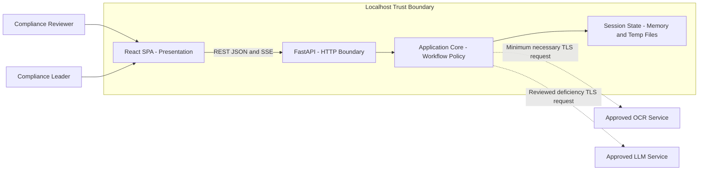
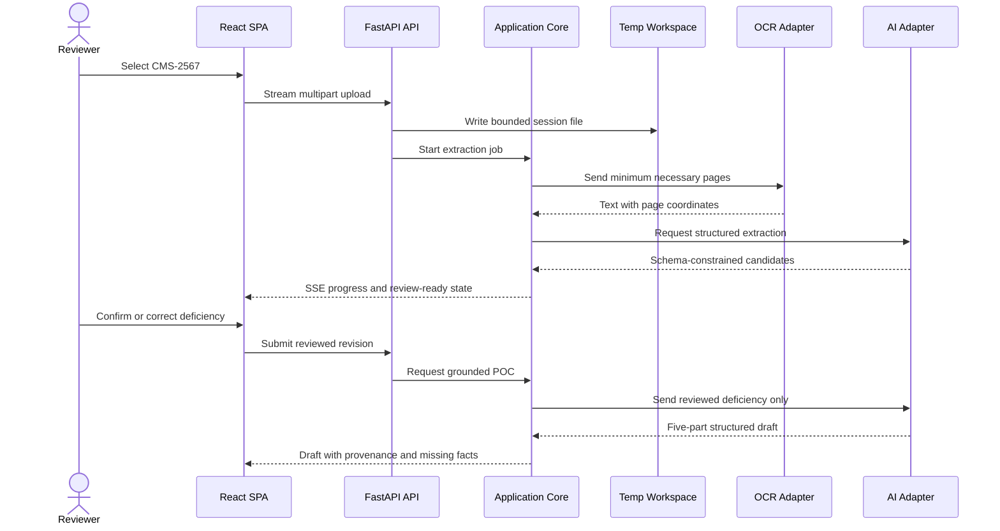

# Architecture Design

## Project Overview

The CMS Deficiency Action Planner is a localhost application for nursing-home
compliance reviewers and designated compliance leaders. A React frontend and a
separate Python API backend support CMS-2567 upload, evidence-linked extraction,
OCR fallback, uncertainty review, grounded five-part POC drafting, editing,
approval, and labeled export. The architecture keeps case data transient,
isolates external OCR and AI providers behind approved adapters, and preserves
human authority over every correction and approval.

This document defines the approved architecture and recommended future module
layout. It does not implement the application or create `frontend/`, `backend/`,
or source-code scaffolding.

## Architecture Goals

- Goal 1: Keep the React frontend and Python backend independently structured
  and connected only through versioned HTTP contracts.
- Goal 2: Use a modular monolith and inward-facing ports so web, OCR, AI,
  filesystem, and authentication frameworks do not leak into domain policy.
- Goal 3: Preserve page evidence, confidence, content provenance, and human
  approval as first-class data throughout extraction and drafting.
- Goal 4: Keep document and case state transient while supporting streamed files
  up to 50 MB and 200 pages without loading entire uploads into memory.
- Goal 5: Meet the confirmed single-user performance targets while containing
  slow or failed OCR and AI dependencies.
- Goal 6: Restrict access to local authenticated users and enforce reviewer and
  compliance-leader permissions at the API boundary.
- Goal 7: Minimize PHI disclosure through provider-neutral, BAA-approved external
  service adapters with explicit retention and training restrictions.
- Goal 8: Make future provider replacement or durable persistence possible
  through ports without adding those capabilities to the MVP.

## Non-Functional Requirements

- NFR-001: [SOURCE:INPUT] The system MUST serve non-processing API requests
  for one concurrent authenticated user at p95 below 300 ms with fewer than 0.5%
  application errors during a steady-state test of at least 1,000 requests.
  Basis: The user confirmed one user and p95 below 300 ms; the measurable local
  application error budget is an architecture inference.
- NFR-002: [SOURCE:INPUT] The system MUST complete extraction for a valid
  100-page document within 5 minutes for at least 95% of acceptance-test runs
  with one processing job, excluding documented external-service outages.
  Basis: The user selected the 100-page, five-minute, 95%-of-runs target and the
  single-job workload.
- NFR-003: [SOURCE:INPUT] The system MUST accept at most one active upload of no
  more than 50 MB and 200 pages and MUST reject an exceeded byte or page limit
  before OCR or AI processing begins.
  Basis: The user confirmed one active job and the 50 MB/200-page upload boundary.
- NFR-004: [SOURCE:INPUT] The system MUST authenticate every API operation other
  than login and health checks, authorize reviewer and compliance-leader roles
  server-side, and deny every approval operation unless the caller has the
  `compliance_leader` role.
  Basis: The user selected lightweight local accounts, secure server-side
  sessions, and separate reviewer and approver roles.
- NFR-005: [SOURCE:INPUT] The system MUST transmit minimum necessary content only
  to configured OCR or AI services whose BAA, retention, training-use, and risk
  terms have been approved, and MUST block an unapproved provider configuration.
  Basis: The user selected provider-neutral BAA-approved services with no provider
  retention or training use.
- NFR-006: [SOURCE:INPUT] The system MUST remove case metadata and temporary files
  on explicit session end, after 60 minutes without authenticated activity, and
  during graceful backend shutdown; cleanup verification MUST report zero
  remaining case files.
  Basis: The user confirmed all three transient-data cleanup triggers.
- NFR-007: [SOURCE:INPUT] The frontend and backend MUST bind to loopback
  interfaces only, and the backend MUST reject browser origins other than the
  configured local frontend origin.
  Basis: The user confirmed two native localhost processes on separate loopback
  ports.
- NFR-008: [SOURCE:INPUT] Each external OCR or AI call MUST have a configurable
  timeout no greater than 120 seconds, retry transient failures at most twice
  with bounded backoff, and preserve all previously reviewed state when retries
  are exhausted.
  Basis: The specification requires visible recovery and retained reviewed data;
  the timeout and retry limits are architecture inferences.
- NFR-009: [SOURCE:INPUT] Domain and application modules MUST have no imports
  from web frameworks or provider SDKs, and their automated tests MUST maintain
  at least 80% branch coverage.
  Basis: Framework-independent boundaries and a measurable coverage floor are
  inferred to keep the six-to-eight-week modular MVP maintainable.
- NFR-010: [SOURCE:INPUT] Every API request and processing job MUST carry a
  correlation identifier, every failed stage MUST emit a structured diagnostic,
  and automated log tests MUST verify that document text, SOD text, POC text,
  credentials, and provider payloads are absent from logs.
  Basis: Correlated, PHI-redacted diagnostics are inferred from the requested
  error-handling and security trust boundaries.

**Note**: No unclear non-functional requirements remain after architecture
elicitation.

## Data Requirements

- DR-001: [SOURCE:INPUT] The backend MUST be the sole writer of active case state
  and MUST represent each case as one session-scoped aggregate containing the
  document manifest, processing jobs, provider fields, deficiencies, POC drafts,
  approval state, and provenance state.
  Basis: The specification requires transient session state across intake,
  review, drafting, approval, and export.
- DR-002: [SOURCE:INPUT] Each extracted or edited value MUST retain an immutable
  identifier, original extracted value, page number, supporting snippet,
  confidence, uncertainty state, current value, content origin, and revision
  number; an edit MUST create a new revision rather than overwrite evidence.
  Basis: FR-004, FR-008, FR-009, FR-015, and FR-018 require evidence,
  corrections, provenance, and approval invalidation.
- DR-003: [SOURCE:INPUT] Upload bytes MUST be streamed into a randomized
  per-session temporary workspace, MUST NOT derive filesystem paths from the
  client filename, and MUST be removed if validation or processing fails.
  Basis: The user selected temporary streamed storage for the 50 MB/200-page
  boundary and transient cleanup.
- DR-004: [SOURCE:INPUT] Cleanup MUST remove the in-memory aggregate and every
  file under its temporary workspace as one idempotent lifecycle operation and
  MUST expose a completed or failed cleanup status without retaining document
  content in the status record.
  Basis: The user confirmed cleanup at explicit end, 60-minute inactivity, and
  backend shutdown while FR-020 requires transient state.
- DR-005: [SOURCE:INPUT] The MVP MUST use no application database, durable case
  cache, backup, restore, or data migration mechanism; backend restart MUST begin
  with zero recoverable case records.
  Basis: The specification excludes databases and persistent document management,
  and the user selected no database for the architecture.
- DR-006: [SOURCE:INPUT] Runtime configuration MUST be loaded from environment
  variables or ignored local environment files, validated before the API accepts
  traffic, and MUST keep credential hashes, session secrets, provider keys, and
  provider approvals outside source code and API responses.
  Basis: The user selected local accounts with credentials outside source code
  and environment-configured native processes.

**Note**: No persistent domain entities are defined because DR-005 prohibits
application persistence for the MVP.

## AI Consideration

**Status:** Applicable

The upstream specification contains `[HYBRID]` requirements for OCR-assisted
extraction, uncertainty handling, and grounded POC generation. AI can propose
structured extraction and draft content, but deterministic validation and
authorized human decisions remain mandatory before confirmation, approval, or
export.

## AI Requirements

- AIR-001: [SOURCE:INPUT] The system MUST invoke OCR and LLM capabilities only
  through application-owned ports whose configured adapters satisfy NFR-005 and
  can be replaced without changes to domain or application modules.
  Basis: The user selected provider-neutral BAA-approved adapters with no
  provider retention or training use.
  Traces to: NFR-005, NFR-009.
- AIR-002: [SOURCE:INPUT] Every AI-assisted extraction response MUST validate
  against a closed schema that requires provider fields, deficiency boundaries,
  F-tags, complete SOD text, page references, snippets, confidence, and
  uncertainty indicators before it enters case state.
  Basis: FR-003 through FR-008 require evidence-linked extraction and explicit
  uncertainty.
  Traces to: NFR-002, NFR-003, NFR-009.
- AIR-003: [SOURCE:INPUT] Every generated POC response MUST validate against a
  closed schema containing exactly the five approved draft sections and MUST be
  rejected as incomplete when a required section is absent.
  Basis: FR-011 and FR-012 require one structured five-part POC per reviewed
  deficiency.
  Traces to: NFR-009.
- AIR-004: [SOURCE:INPUT] Every facility-specific generated claim MUST reference
  one or more reviewed input fields or evidence spans; when no support exists,
  the output MUST contain a typed missing-information marker instead of a claim.
  Basis: FR-013 requires grounded content, explicit missing facts, and no invented
  facility values.
  Traces to: NFR-005, NFR-010.
- AIR-005: [SOURCE:INPUT] AI output MUST remain unconfirmed and unapproved, MUST
  expose uncertainty and provenance to the reviewer, and MUST NOT bypass the
  reviewer-confirmation or compliance-leader approval gates.
  Basis: FR-006, FR-010, FR-015, FR-016, and FR-017 establish mandatory human
  control.
  Traces to: NFR-004, NFR-009.
- AIR-006: [SOURCE:INPUT] Release evaluation MUST demonstrate at least 95%
  field-level accuracy for provider name, F-tag, and complete SOD text, surface
  every missed deficiency as uncertain, and produce zero unsupported
  facility-specific claims in the approved evaluation set.
  Basis: The upstream success criteria quantify extraction completeness and POC
  grounding quality.
  Traces to: NFR-002, NFR-010.

**Note**: No unclear AI requirements remain after provider-boundary elicitation.

### AI Architecture Pattern

**Selected Pattern:** Hybrid structured generation with deterministic validation
and human approval

**Rationale:** OCR and LLM adapters produce schema-constrained candidates;
application services validate structure, grounding, provenance, and workflow
state before presenting results to people. A vector store and retrieval-augmented
generation are excluded because each draft is grounded in one active document
and its reviewed deficiency record. Fine-tuning is excluded because the MVP has
no approved training corpus and AIR-006 can be evaluated with prompt-and-schema
orchestration first.

## Architecture and Design Decisions

- [SOURCE:INPUT] Architecture style: React feature-sliced SPA plus a FastAPI
  modular monolith with clean/hexagonal dependency direction — Rejected:
  conventional layers because provider concerns can leak inward; microservices
  because one user and one job do not justify distributed operations — Driver:
  NFR-001 p95 below 300 ms, NFR-003 one job, NFR-009 80% core coverage.
  Basis: The user selected this style after comparing both alternatives.
- [SOURCE:INPUT] Frontend responsibility: Browser presentation, interaction
  state, form validation, and typed API consumption only — Rejected: business
  workflow decisions in React because the browser is outside the trusted state
  boundary — Driver: NFR-004 server-side authorization and DR-001 sole backend
  ownership.
  Basis: Separate applications and server-owned transient state were confirmed.
- [SOURCE:INPUT] Backend responsibility: API orchestration, domain policy,
  processing jobs, evidence/provenance, authorization, and state lifecycle —
  Rejected: provider SDK calls from route handlers because they prevent adapter
  replacement and isolated tests — Driver: NFR-009 and AIR-001.
  Basis: The user selected a modular monolith with provider-neutral ports.
- [SOURCE:INPUT] Job execution: One lifecycle-managed in-process job runner with
  a concurrency limit of one and explicit cancellation — Rejected: Celery,
  Redis, or a message broker because durable distributed queues conflict with
  DR-005 — Driver: NFR-002 five-minute processing and NFR-003 one active job.
  Basis: The confirmed workload is one user and one processing job.
- [SOURCE:INPUT] Integration style: Versioned REST/JSON, streamed multipart
  upload, and typed Server-Sent Events — Rejected: polling because it adds
  repeated requests; GraphQL/WebSockets because bidirectional complexity is not
  required — Driver: NFR-001, NFR-002, and NFR-003.
  Basis: The user explicitly selected REST, multipart streaming, and SSE.
- [SOURCE:INPUT] State placement: In-memory case repository plus randomized
  per-session temporary workspace — Rejected: all bytes in memory because a
  50 MB upload plus OCR artifacts can cause memory spikes; SQLite because case
  persistence is out of scope — Driver: NFR-003, NFR-006, DR-003, DR-005.
  Basis: The user selected this state model from the persistence alternatives.
- [SOURCE:INPUT] Identity and access: Local account hashes and roles loaded from
  protected configuration, opaque server-side sessions, and endpoint permission
  checks — Rejected: UI role selection because it is not authorization; JWTs
  because stateless tokens complicate immediate session revocation — Driver:
  NFR-004 and NFR-006.
  Basis: The user selected lightweight local accounts and server-side sessions.
- [SOURCE:INPUT] OCR and AI integration: Application-owned ports, BAA-approved
  adapters, minimum-necessary requests, and schema validation — Rejected: fixed
  vendor coupling and bundled local models because neither is approved by the
  current scope — Driver: NFR-005, AIR-001 through AIR-006.
  Basis: The user selected provider-neutral guarded adapters.
- [SOURCE:EXTERNAL] API contract: FastAPI-generated OpenAPI 3.1.0 is the contract source for REST,
  multipart, SSE, schemas, errors, and security requirements — Rejected:
  handwritten duplicate frontend types because they drift; OpenAPI 3.2.1 until
  FastAPI supports generating it — Driver: NFR-009 and DR-002.
  Basis: FastAPI 0.141.1 officially generates OpenAPI 3.1.0; changing only the
  declared version does not generate a different schema.
- [SOURCE:INFERRED] Error model: Stable problem-detail responses plus job-stage
  errors classified as validation, authorization, provider-transient,
  provider-permanent, cancellation, or internal — Rejected: raw exceptions
  because they leak internals and do not support recovery — Driver: NFR-008 and
  NFR-010.
  Basis: A typed error taxonomy is inferred from the requested failure handling
  and retry behavior.
- [SOURCE:INPUT] Local deployment: Two native processes bound to loopback with an
  explicit frontend-origin allow-list — Rejected: Docker Compose and a combined
  process because the user selected native separated applications — Driver:
  NFR-007.
  Basis: The user confirmed the native localhost deployment anchor.

**Component view**



**Processing data flow**



**API boundary**

| Boundary | Method and path | Responsibility |
|---|---|---|
| Authentication | `POST /api/v1/auth/session` | Verify local credentials and create an opaque server session |
| Authentication | `DELETE /api/v1/auth/session` | Revoke authentication and clear session cookie |
| Case lifecycle | `POST /api/v1/cases` | Stream and validate one CMS-2567 upload |
| Case lifecycle | `DELETE /api/v1/cases/{caseId}` | End the case and trigger idempotent cleanup |
| Processing | `POST /api/v1/cases/{caseId}/extraction-jobs` | Start the single bounded extraction job |
| Progress | `GET /api/v1/jobs/{jobId}/events` | Stream typed progress and terminal status with SSE |
| Review | `GET /api/v1/cases/{caseId}` | Return the current evidence-linked case projection |
| Review | `PATCH /api/v1/cases/{caseId}/deficiencies/{deficiencyId}` | Add a reviewed correction revision or confirmation |
| POC | `POST /api/v1/cases/{caseId}/deficiencies/{deficiencyId}/poc` | Generate a grounded draft from reviewed data |
| POC | `PATCH /api/v1/cases/{caseId}/pocs/{pocId}` | Add a user-edited draft revision and revoke prior approval |
| Approval | `POST /api/v1/cases/{caseId}/pocs/{pocId}/approval` | Approve current revision after leader authorization |
| Export | `GET /api/v1/cases/{caseId}/pocs/{pocId}/export` | Return approved labeled content for copy or download |

All identifiers are opaque UUIDs. Every mutation requires a CSRF token bound to
the server-side authentication session. Request and response models are generated
or verified against the OpenAPI contract; frontend code does not import backend
runtime models.

**Trust boundaries**

| Boundary | Allowed data | Controls |
|---|---|---|
| Browser to FastAPI | Credentials, upload stream, reviewed edits, commands | Loopback origin allow-list, HttpOnly SameSite cookie, CSRF token, schema and size validation |
| FastAPI to temporary workspace | Uploaded bytes and processing artifacts | Randomized paths, no client path use, session ownership, startup and lifecycle cleanup |
| Application core to OCR adapter | Minimum required pages and correlation metadata | Approved adapter allow-list, TLS, timeout, retry policy, no payload logging |
| Application core to AI adapter | Reviewed deficiency fields and evidence needed for the requested operation | Approved adapter allow-list, TLS, closed output schema, claim grounding, no provider retention or training |
| Configuration to runtime | Credential hashes, session secret, provider keys and approval flags | Environment loading, startup validation, redaction, no frontend exposure |

**Failure modes and detection**

| Failure | Containment and recovery | Detection |
|---|---|---|
| Invalid or oversized upload | Stop streaming, remove partial file, return validation problem | Upload byte/page counters and validation error code |
| Native extraction or OCR failure | Mark page/stage failed and preserve other candidates | Job stage status and correlated provider error class |
| Provider timeout or throttling | Retry transient errors within NFR-008, then expose retryable failure | Attempt count, timeout metric, terminal SSE event |
| AI schema or grounding failure | Reject output, retain reviewed deficiency, permit regeneration | Schema violations and unsupported-claim count |
| SSE disconnect | Preserve job state and allow reconnect using last event identifier | Connection close and resume cursor |
| Unauthorized approval/export | Deny without changing state | Authorization decision with actor ID but no case text |
| Process crash | Lose in-memory case state and purge orphan workspaces before accepting new traffic | Startup cleanup result and zero-residue check |
| Cleanup failure | Mark cleanup failed, deny workspace reuse, and retry without logging content | Remaining-file count and correlation identifier |

**Evolution notes**

- A durable repository can replace the in-memory port only after persistence,
  retention, migration, and backup requirements are approved.
- An external queue and worker can replace the in-process runner only if the
  workload exceeds one concurrent job or recovery across restarts becomes a
  requirement.
- OCR and LLM providers can change by adding adapters that pass AIR-001 through
  AIR-006 and the organization's BAA/risk review.
- Cloud or shared-network deployment requires a new design pass for TLS
  termination, enterprise identity, tenancy, durable state, audit retention,
  infrastructure, and operational availability.

## Technology Stack

| Layer | Technology | Version | Justification |
|---|---|---|---|
| Frontend | React, TypeScript, Vite | React 19.3; TypeScript 7.0; Vite 8.3 | TR-002 satisfies NFR-001 and NFR-009 with a typed standalone SPA |
| Mobile | N/A | N/A | Mobile delivery is outside the MVP scope |
| Backend | Python, FastAPI, Pydantic, Uvicorn | Python 3.14.7; FastAPI 0.141.1; Pydantic 2.x; compatible Uvicorn | TR-003 provides typed async APIs and provider integration for NFR-001 and NFR-002 |
| Database | None; in-memory repository and temporary workspace | N/A | DR-001 through DR-005 prohibit durable case persistence |
| AI/ML | Provider-neutral OCR/LLM adapters with Pydantic/JSON Schema guardrails | Adapter contract v1; JSON Schema 2020-12 | AIR-001 through AIR-006 require replaceable providers and validated output |
| Testing | Vitest, React Testing Library, pytest, HTTPX, Playwright | Vitest 4.x; pytest 9.x; Playwright 1.x | TR-013 verifies NFR-009 and cross-application contracts |
| Infrastructure | Native Node.js and CPython processes | Node.js 24 LTS; Python 3.14.7 | TR-014 implements the selected localhost runtime without containers |
| Security | Argon2id credential hashes, opaque server sessions, CSRF tokens | Current stable compatible releases | TR-009 implements NFR-004 without browser-readable authentication tokens |
| Deployment | Loopback-bound Vite and Uvicorn processes | Vite 8.3; FastAPI 0.141.1 | TR-014 implements NFR-007 and preserves application separation |
| Monitoring | Structured Python logging and browser/API performance timing | Python 3.14 standard logging; Web Performance APIs | TR-012 provides NFR-010 diagnostics without a remote telemetry service |
| Documentation | OpenAPI and Mermaid | OpenAPI 3.1.0; Mermaid 11.x | TR-004 keeps API contracts machine-readable and architecture views reviewable |

Version pins are architecture baselines as of 2026-09-23. Implementation must
record exact dependency versions in each application's lockfile and must not
silently advance a major version.

### AI Component Stack

| Component | Technology | Purpose |
|---|---|---|
| Model Provider | Runtime-selected BAA-approved LLM adapter | Structured extraction and five-part POC inference |
| Vector Store | None | Active reviewed case data is supplied directly; no retrieval corpus exists |
| AI Gateway | Application-owned provider facade and HTTP client adapters | Request minimization, timeouts, retries, provider replacement, and response normalization |
| Guardrails | Pydantic 2.x plus closed JSON Schema and grounding validator | Reject malformed, incomplete, or unsupported extraction and POC output |

### Alternative Technology Options

- Next.js was rejected because server rendering and an additional server runtime
  do not improve a single-user localhost workflow; the FastAPI API remains the
  only trusted backend.
- Django REST Framework was rejected because built-in ORM and administrative
  capabilities add persistence-oriented complexity that DR-005 excludes.
- Flask was rejected because FastAPI provides first-class typed validation,
  OpenAPI generation, async endpoints, file upload handling, and SSE support
  aligned with TR-004 through TR-006.
- Redis/Celery was rejected because one job and no durable recovery do not justify
  a broker or worker deployment.
- A fixed Azure OCR/LLM stack and fully local models remain valid future adapters,
  but neither is selected until provider approval or local model validation is
  complete.
- A vector database was rejected because the active document and reviewed
  deficiency are bounded inputs, not a reusable retrieval corpus.

### Technology Decision

| Metric (from NFR/DR/AIR) | React/Vite + FastAPI modular monolith | Next.js + Django REST | Rationale |
|---|---:|---:|---|
| Single-user p95 below 300 ms (NFR-001) | 5 | 4 | Both fit, but the selected stack has fewer server layers |
| Five-minute document processing (NFR-002) | 5 | 4 | FastAPI async provider adapters and a bounded runner match the workload |
| No durable persistence (DR-005) | 5 | 2 | The selected stack does not center an ORM or database lifecycle |
| Framework-independent provider ports (AIR-001, NFR-009) | 5 | 3 | Hexagonal adapters isolate OCR and LLM SDKs explicitly |
| Six-to-eight-week MVP scope | 5 | 3 | Separate SPA and typed API minimize unrelated platform capability |

**Model Provider Decision**

| Metric (from NFR/DR/AIR) | Runtime-approved adapter | Fixed Azure provider | Rationale |
|---|---:|---:|---|
| BAA and retention approval (NFR-005) | 5 | 3 | Runtime configuration prevents use before organizational approval |
| Replaceability (AIR-001) | 5 | 2 | The application port prevents provider SDK coupling |

**Vector Store Decision**

| Metric (from NFR/DR/AIR) | None | Local vector database | Rationale |
|---|---:|---:|---|
| No persistent data (DR-005) | 5 | 1 | No vector state avoids a new persistence boundary |
| Grounding scope (AIR-004) | 5 | 2 | One reviewed deficiency can be passed directly and deterministically |

**AI Gateway Decision**

| Metric (from NFR/DR/AIR) | Internal provider facade | External AI gateway product | Rationale |
|---|---:|---:|---|
| Minimum necessary disclosure (NFR-005) | 5 | 3 | The internal facade owns request shaping before provider transmission |
| Single-job simplicity (NFR-003) | 5 | 2 | A separate gateway service adds no capacity benefit |

**Guardrails Decision**

| Metric (from NFR/DR/AIR) | Pydantic plus grounding validator | Prompt-only validation | Rationale |
|---|---:|---:|---|
| Closed output schemas (AIR-002, AIR-003) | 5 | 1 | Runtime models reject missing or additional fields deterministically |
| Zero unsupported claims (AIR-004, AIR-006) | 5 | 1 | Claim-to-evidence checks cannot rely on prompt compliance alone |

## Technical Requirements

- TR-001: [SOURCE:INPUT] The repository MUST contain separate top-level
  `frontend/` and `backend/` applications with independent dependency manifests,
  test commands, environment examples, and build outputs; neither application
  MUST import source files from the other.
  Basis: The user mandated separate applications under the specified repository
  root structure.
  Traces to: NFR-009, DR-006.
- TR-002: [SOURCE:INPUT] The frontend MUST use React 19.3, TypeScript 7.0, and
  Vite 8.3 and MUST organize UI code by document intake, extraction review, POC
  authoring, and approval/export feature slices that consume a shared typed API
  client.
  Basis: The user selected the React/Vite/TypeScript framework anchor and a
  modern separated frontend.
  Traces to: NFR-001, NFR-009, DR-001.
- TR-003: [SOURCE:INPUT] The backend MUST use Python 3.14.7 and FastAPI 0.141.1
  as a modular monolith whose domain and application packages own interfaces and
  whose HTTP, filesystem, OCR, AI, authentication, and logging adapters depend
  inward.
  Basis: The user selected FastAPI, Python 3.14, modular-monolith structure, and
  clean/hexagonal boundaries.
  Traces to: NFR-001, NFR-002, NFR-009, AIR-001.
- TR-004: [SOURCE:EXTERNAL] The backend MUST publish a versioned OpenAPI 3.1.0
  contract for every REST, multipart, SSE, error, and security operation, and a
  contract test MUST fail when the generated frontend types differ from that
  contract.
  Basis: FastAPI 0.141.1 officially generates OpenAPI 3.1.0 with language-neutral
  HTTP contracts, schemas, and security definitions.
  Traces to: NFR-009, DR-002.
- TR-005: [SOURCE:INPUT] The upload adapter MUST stream multipart content to the
  session workspace, enforce the 50 MB byte limit while reading, validate media
  type and CMS-2567 structure, enforce the 200-page limit before processing, and
  delete every rejected partial file.
  Basis: NFR-003 and DR-003 define the confirmed upload and transient-storage
  boundaries.
  Traces to: NFR-003, NFR-006, DR-003, DR-004.
- TR-006: [SOURCE:INPUT] Long-running jobs MUST emit ordered SSE events with job
  ID, event ID, stage, percent complete, timestamp, and terminal status; reconnect
  MUST resume after the caller's last event ID without replaying document text.
  Basis: The user selected SSE for extraction and generation progress.
  Traces to: NFR-002, NFR-010, DR-001.
- TR-007: [SOURCE:INPUT] A backend repository port MUST own in-memory case
  aggregates, a workspace port MUST own temporary files, and lifecycle services
  MUST clear both stores idempotently on every NFR-006 trigger and at startup.
  Basis: The user selected backend-owned memory plus per-session temporary
  workspaces and deterministic cleanup.
  Traces to: NFR-006, DR-001, DR-003, DR-004, DR-005.
- TR-008: [SOURCE:INPUT] OCR and LLM outbound adapters MUST implement
  application-owned interfaces, minimize request payloads, enforce provider
  approval before invocation, apply NFR-008 timeouts and retries, and validate
  every response against AIR-002 or AIR-003 before returning it.
  Basis: The selected provider-neutral AI pattern requires replaceable adapters,
  approved boundaries, and deterministic guardrails.
  Traces to: NFR-005, NFR-008, AIR-001, AIR-002, AIR-003, AIR-004.
- TR-009: [SOURCE:INPUT] Authentication MUST verify configured Argon2id password
  hashes, rotate the opaque session ID at login, store sessions only on the
  backend, issue a host-only HttpOnly SameSite=Strict cookie, require a
  session-bound CSRF token for mutations, and enforce role checks in application
  services as well as route dependencies.
  Basis: The selected local-account model and NFR-004 require server-side identity
  and authorization controls.
  Traces to: NFR-004, NFR-006, DR-006.
- TR-010: [SOURCE:INPUT] A typed configuration component MUST load frontend
  origin, loopback bind addresses, ports, workspace root, limits, credential
  hashes, session secret, provider endpoints, provider keys, approval flags,
  timeout values, and retention values and MUST fail startup on any missing or
  contradictory required setting.
  Basis: The user selected environment-configured native processes and protected
  provider and account configuration.
  Traces to: NFR-005, NFR-006, NFR-007, NFR-008, DR-006.
- TR-011: [SOURCE:INPUT] The API MUST return stable problem-detail envelopes
  containing code, safe message, correlation ID, retryability, and field errors;
  the job model MUST preserve the corresponding typed failure stage without
  exposing stack traces or provider payloads.
  Basis: The error taxonomy and safe response shape are inferred from NFR-008,
  NFR-010, and the requested error-handling boundary.
  Traces to: NFR-008, NFR-010.
- TR-012: [SOURCE:INPUT] Structured logs MUST record timestamp, level,
  correlation ID, actor ID, route or job stage, duration, result code, and provider
  name while redacting all fields prohibited by NFR-010; tests MUST scan captured
  logs for prohibited content.
  Basis: The structured logging fields and automated redaction check are inferred
  from the observability and PHI boundary.
  Traces to: NFR-005, NFR-010.
- TR-013: [SOURCE:INPUT] The implementation MUST use Vitest and React Testing
  Library for frontend units, pytest and HTTPX for backend units and API
  integration, generated-contract compatibility tests, provider-adapter contract
  tests, and Playwright for upload-to-export workflows; core branch coverage MUST
  meet NFR-009.
  Basis: The specific layered test stack is inferred to verify the selected
  architecture and the 80% core branch-coverage target.
  Traces to: NFR-002, NFR-004, NFR-006, NFR-009, AIR-006.
- TR-014: [SOURCE:INPUT] Local development MUST run the Vite frontend and FastAPI
  backend as separate native processes on distinct configurable loopback ports,
  permit only the configured frontend origin, and provide independent health
  checks without combining build artifacts or runtime ownership.
  Basis: The user selected two native localhost processes with separate
  responsibilities and well-defined APIs.
  Traces to: NFR-001, NFR-007, DR-006.

**Note**: No unclear technical requirements remain after anchor confirmation.

## Technical Constraints & Assumptions

- The architecture is greenfield; no existing frontend or backend codebase was
  available for compatibility analysis.
- The implementation repository will contain `frontend/` and `backend/`, but
  those directories are intentionally not created by this architecture workflow.
- The MVP runs one frontend process and one backend process on configurable
  loopback ports. Binding either process to a LAN or public interface is outside
  the approved design.
- The frontend owns rendering and interaction state only. FastAPI owns workflow
  policy, authorization, case state, files, provider calls, approval, and export.
- The API uses `/api/v1` resource paths and an OpenAPI contract. Breaking contract
  changes require a new API version; additive schema fields remain optional to
  older clients.
- The in-process runner accepts one active extraction or generation job. It is
  not durable and does not resume work after backend restart.
- Temporary workspaces are operational scratch space, not document persistence.
  Startup cleanup removes orphan workspaces before the health check becomes ready.
- Local account hashes and roles are deployment configuration, not application
  case data. Password reset and enterprise identity federation are outside scope.
- Browser cookies are host-only, HttpOnly, and SameSite=Strict. The Secure flag
  is mandatory whenever local HTTPS is enabled; plain HTTP is limited to loopback
  development.
- Provider adapters cannot be enabled until configuration asserts organizational
  approval and the privacy/security owner has validated the BAA, retention,
  training-use, incident-reporting, and risk terms.
- No vector store, model training, fine-tuning, durable audit ledger, analytics
  store, or CMS submission integration is included.
- Python, Node.js, framework, and tool versions are pinned independently in the
  future application lockfiles. Major upgrades require architecture compatibility
  review and contract tests.
- State-specific POC content rules, supported languages beyond English, and the
  final representative evaluation corpus remain product/compliance dependencies,
  not technology defaults.

**Functional requirement traceability**

| Source requirement | Architecture coverage |
|---|---|
| FR-001 | NFR-003, DR-003, TR-005 |
| FR-002 | NFR-003, DR-003, TR-005, TR-011 |
| FR-003 | NFR-002, NFR-008, TR-008 |
| FR-004 | DR-002, TR-008 |
| FR-005 | DR-002, TR-008 |
| FR-006 | DR-002, TR-008 |
| FR-007 | NFR-008, TR-011 |
| FR-008 | DR-002, TR-004 |
| FR-009 | DR-002, TR-007 |
| FR-010 | NFR-004, TR-003, TR-009 |
| FR-011 | NFR-002, TR-008 |
| FR-012 | NFR-009, TR-008 |
| FR-013 | NFR-005, TR-008 |
| FR-014 | NFR-008, TR-011 |
| FR-015 | DR-002, TR-004 |
| FR-016 | NFR-004, TR-009 |
| FR-017 | NFR-004, TR-009 |
| FR-018 | DR-002, TR-009 |
| FR-019 | NFR-004, TR-004 |
| FR-020 | NFR-006, DR-004, TR-007 |

**Configuration ownership**

| Setting group | Examples | Owner and validation |
|---|---|---|
| Frontend public configuration | API base URL, frontend port | Vite startup; values contain no secrets |
| API network configuration | loopback host, API port, allowed frontend origin | Backend startup rejects non-loopback defaults or origin mismatch |
| Session configuration | idle minutes `60`, cookie name, session secret | Backend security adapter; secret must be present and non-default |
| Intake limits | bytes `52428800`, pages `200`, workspace root | Intake and workspace adapters validate consistent limits |
| Provider configuration | adapter name, endpoint, key, approved flag, timeout | Provider composition root blocks missing or unapproved settings |
| Account configuration | user identifier, Argon2id hash, role | Authentication adapter validates unique IDs and allowed roles |
| Logging configuration | level, local sink, redaction policy | Observability adapter forbids payload/body logging |

**Localhost development setup**

1. Install Node.js 24 LTS and Python 3.14.7 using trusted distributions.
2. Install frontend and backend dependencies from their independent lockfiles.
3. Create ignored local environment files from non-secret example files and add
   account hashes, session secret, local origins, limits, and approved provider
   settings.
4. Start FastAPI on its configured loopback port and wait for startup cleanup and
   configuration validation to report ready.
5. Start Vite on its configured loopback port and allow only that exact origin in
   FastAPI CORS configuration.
6. Verify backend health, authentication, OpenAPI contract compatibility, SSE
   reconnection, and transient-workspace cleanup before processing documents.

**Recommended implementation structure**

```text
project-root/
├── frontend/
│   ├── src/
│   │   ├── app/                    # composition, routes, providers
│   │   ├── features/
│   │   │   ├── document-intake/
│   │   │   ├── extraction-review/
│   │   │   ├── poc-authoring/
│   │   │   └── approval-export/
│   │   └── shared/
│   │       ├── api/                # generated client and SSE transport
│   │       ├── model/              # frontend-only view types
│   │       └── ui/                 # reusable presentation components
│   └── tests/
└── backend/
    ├── src/
    │   └── cms_planner/
    │       ├── app.py              # composition root only
    │       ├── api/                 # FastAPI routes, schemas, dependencies
    │       ├── domain/              # entities, value objects, policies
    │       ├── application/         # use cases and owned ports
    │       ├── modules/
    │       │   ├── intake/
    │       │   ├── extraction/
    │       │   ├── review/
    │       │   ├── poc/
    │       │   ├── approval/
    │       │   └── export/
    │       ├── adapters/
    │       │   ├── auth/
    │       │   ├── filesystem/
    │       │   ├── ocr/
    │       │   └── ai/
    │       └── infrastructure/
    │           ├── config/
    │           ├── observability/
    │           └── state/
    └── tests/
        ├── unit/
        ├── integration/
        └── contract/
```

Feature modules depend on `domain/` and `application/` contracts. Adapters and
FastAPI wiring depend inward and are connected only in `app.py`. Frontend feature
slices import cross-feature capabilities through explicit public exports and use
the generated API client rather than backend source code.
