# Design Modelling

## UML Models Overview

This document visualizes the CMS Deficiency Action Planner defined by the
requirements specification and architecture design. The Architectural Views
section presents the React/FastAPI component boundary, native localhost
deployment, end-to-end document flow, transient logical data model, and guarded
AI processing. The Use Case Sequence Diagrams section then maps each UC-001
through UC-010 to component interactions, alternatives, and failure paths.

The models treat the backend as the sole owner of transient case state, keep the
frontend and backend as separate applications, isolate OCR and LLM providers
behind approved adapters, and show no database, cloud hosting, vector store, or
CMS submission path.

---

## Architectural Views

### Component Architecture Diagram

<!-- RENDER type="mermaid" src="./uml-models/DM-001-component-architecture.png" -->

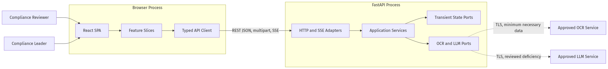

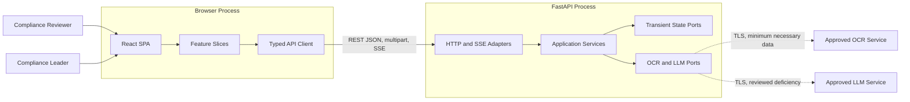
```mermaid
flowchart LR
  Reviewer[Compliance Reviewer]
  Leader[Compliance Leader]
  OCR[Approved OCR Service]
  LLM[Approved LLM Service]

  subgraph Browser[Browser Process]
    UI[React SPA]
    Features[Feature Slices]
    Client[Typed API Client]
    UI --> Features --> Client
  end

  subgraph Backend[FastAPI Process]
    API[HTTP and SSE Adapters]
    Core[Application Services]
    State[Transient State Ports]
    Providers[OCR and LLM Ports]
    API --> Core
    Core --> State
    Core --> Providers
  end

  Reviewer --> UI
  Leader --> UI
  Client -->|REST JSON, multipart, SSE| API
  Providers -.->|TLS, minimum necessary data| OCR
  Providers -.->|TLS, reviewed deficiency| LLM
```

---

### Deployment Architecture Diagram

<!-- RENDER type="plantuml" src="./uml-models/DM-002-deployment-architecture.png" -->

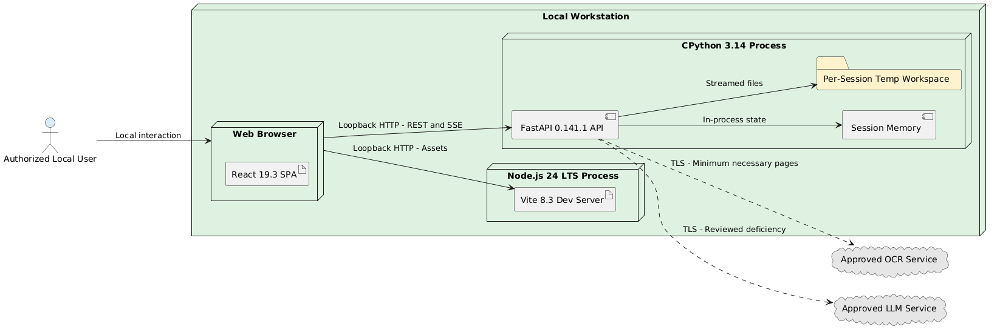

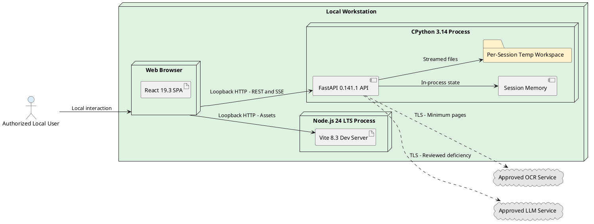
```plantuml
@startuml
left to right direction
skinparam shadowing false
skinparam actorBackgroundColor #DCEBFA
skinparam nodeBackgroundColor #DFF2E1
skinparam cloudBackgroundColor #E6E6E6
skinparam folderBackgroundColor #FFF2CC

actor "Authorized Local User" as User

node "Local Workstation" as Workstation {
  node "Web Browser" as Browser {
    artifact "React 19.3 SPA" as ReactApp
  }
  node "Node.js 24 LTS Process" as NodeProcess {
    artifact "Vite 8.3 Dev Server" as Vite
  }
  node "CPython 3.14 Process" as PythonProcess {
    component "FastAPI 0.141.1 API" as API
    component "Session Memory" as Memory
    folder "Per-Session Temp Workspace" as Temp
  }
}

cloud "Approved OCR Service" as OCR
cloud "Approved LLM Service" as LLM

User --> Browser : Local interaction
Browser --> Vite : Loopback HTTP - Assets
Browser --> API : Loopback HTTP - REST and SSE
API --> Memory : In-process state
API --> Temp : Streamed files
API ..> OCR : TLS - Minimum pages
API ..> LLM : TLS - Reviewed deficiency
@enduml
```

The enhanced infrastructure details table is skipped because no infrastructure
specification exists and cloud deployment is outside the approved MVP scope.

---

### Data Flow Diagram

<!-- RENDER type="plantuml" src="./uml-models/DM-003-data-flow.png" -->

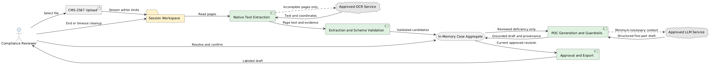

```plantuml
@startuml
left to right direction
skinparam shadowing false
skinparam actorBackgroundColor #DCEBFA
skinparam componentBackgroundColor #DFF2E1
skinparam cloudBackgroundColor #E6E6E6
skinparam folderBackgroundColor #FFF2CC

actor "Compliance Reviewer" as Reviewer
artifact "CMS-2567 Upload" as Document
folder "Session Workspace" as Workspace
component "Native Text Extraction" as Native
cloud "Approved OCR Service" as OCR
component "Extraction and Schema Validation" as Extract
storage "In-Memory Case Aggregate" as State
component "POC Generation and Guardrails" as POC
cloud "Approved LLM Service" as LLM
component "Approval and Export" as Export

Reviewer --> Document : Select file
Document --> Workspace : Stream within limits
Workspace --> Native : Read pages
Native ..> OCR : Incomplete pages only
OCR --> Native : Text and coordinates
Native --> Extract : Page text and evidence
Extract --> State : Validated candidates
Reviewer --> State : Resolve and confirm
State --> POC : Reviewed deficiency only
POC ..> LLM : Minimum necessary context
LLM --> POC : Structured five-part draft
POC --> State : Grounded draft and provenance
State --> Export : Current approved revision
Export --> Reviewer : Labeled draft
Reviewer --> Workspace : End or timeout cleanup
@enduml
```

---

### Logical Data Model (ERD)

<!-- RENDER type="mermaid" src="./uml-models/DM-004-logical-data-model.png" -->

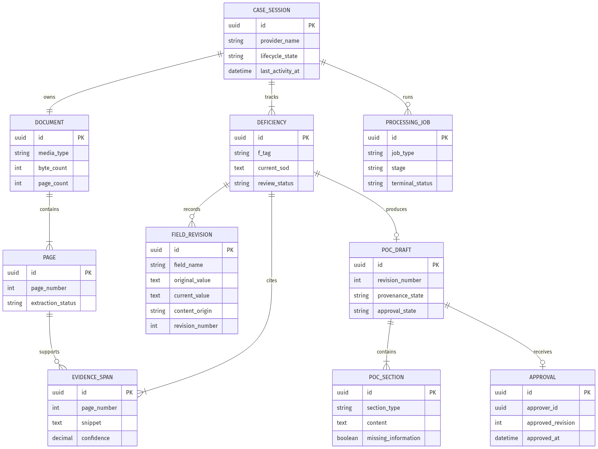

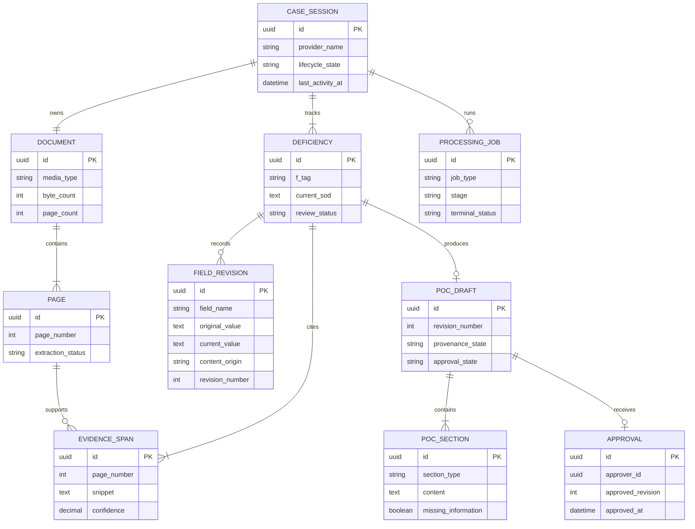
```mermaid
erDiagram
  CASE_SESSION ||--|| DOCUMENT : owns
  DOCUMENT ||--|{ PAGE : contains
  CASE_SESSION ||--|{ DEFICIENCY : tracks
  PAGE ||--o{ EVIDENCE_SPAN : supports
  DEFICIENCY ||--|{ EVIDENCE_SPAN : cites
  DEFICIENCY ||--o{ FIELD_REVISION : records
  CASE_SESSION ||--o{ PROCESSING_JOB : runs
  DEFICIENCY ||--o| POC_DRAFT : produces
  POC_DRAFT ||--|{ POC_SECTION : contains
  POC_DRAFT ||--o| APPROVAL : receives

  CASE_SESSION {
    uuid id PK
    string provider_name
    string lifecycle_state
    datetime last_activity_at
  }
  DOCUMENT {
    uuid id PK
    string media_type
    int byte_count
    int page_count
  }
  PAGE {
    uuid id PK
    int page_number
    string extraction_status
  }
  DEFICIENCY {
    uuid id PK
    string f_tag
    text current_sod
    string review_status
  }
  EVIDENCE_SPAN {
    uuid id PK
    int page_number
    text snippet
    decimal confidence
  }
  FIELD_REVISION {
    uuid id PK
    string field_name
    text original_value
    text current_value
    string content_origin
    int revision_number
  }
  PROCESSING_JOB {
    uuid id PK
    string job_type
    string stage
    string terminal_status
  }
  POC_DRAFT {
    uuid id PK
    int revision_number
    string provenance_state
    string approval_state
  }
  POC_SECTION {
    uuid id PK
    string section_type
    text content
    boolean missing_information
  }
  APPROVAL {
    uuid id PK
    uuid approver_id
    int approved_revision
    datetime approved_at
  }
```

The ERD describes objects held in process memory and temporary workspace
metadata. It does not define database tables or durable records.

---

### AI Architecture Diagrams

#### RAG Pipeline Diagram

<!-- RENDER type="plantuml" src="./uml-models/DM-005-rag-pipeline.png" -->

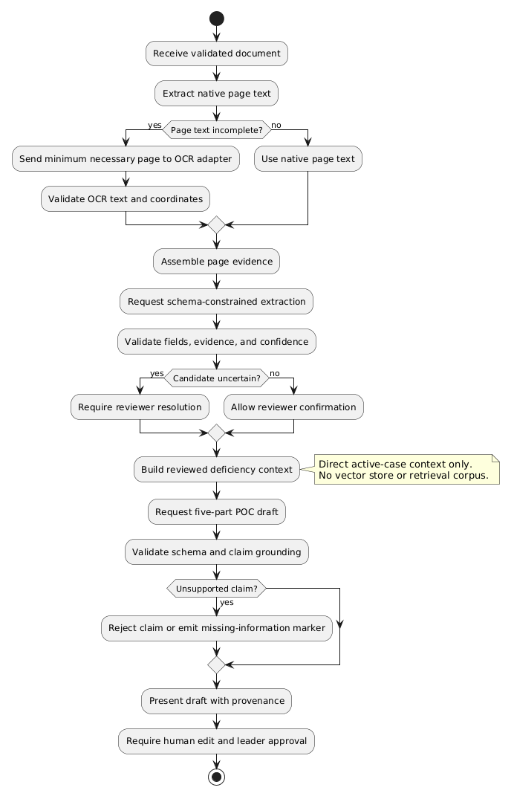

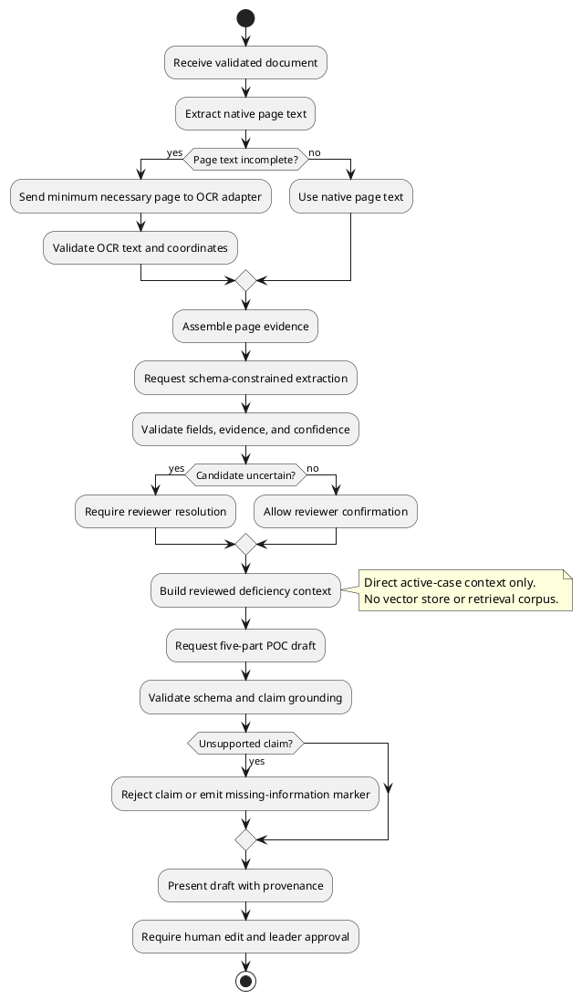
```plantuml
@startuml
skinparam shadowing false
start
:Receive validated document;
:Extract native page text;
if (Page text incomplete?) then (yes)
  :Send minimum necessary page to OCR adapter;
  :Validate OCR text and coordinates;
else (no)
  :Use native page text;
endif
:Assemble page evidence;
:Request schema-constrained extraction;
:Validate fields, evidence, and confidence;
if (Candidate uncertain?) then (yes)
  :Require reviewer resolution;
else (no)
  :Allow reviewer confirmation;
endif
:Build reviewed deficiency context;
note right
  Direct active-case context only.
  No vector store or retrieval corpus.
end note
:Request five-part POC draft;
:Validate schema and claim grounding;
if (Unsupported claim?) then (yes)
  :Reject claim or emit missing-information marker;
endif
:Present draft with provenance;
:Require human edit and leader approval;
stop
@enduml
```

#### AI Sequence Diagram — UC-002

**Source:** [UC-002 in spec.md](./spec.md#uc-002-sourceinput-extract-provider-and-deficiency-data)

<!-- RENDER type="mermaid" src="./uml-models/AI-001-uc-002-extraction.png" -->

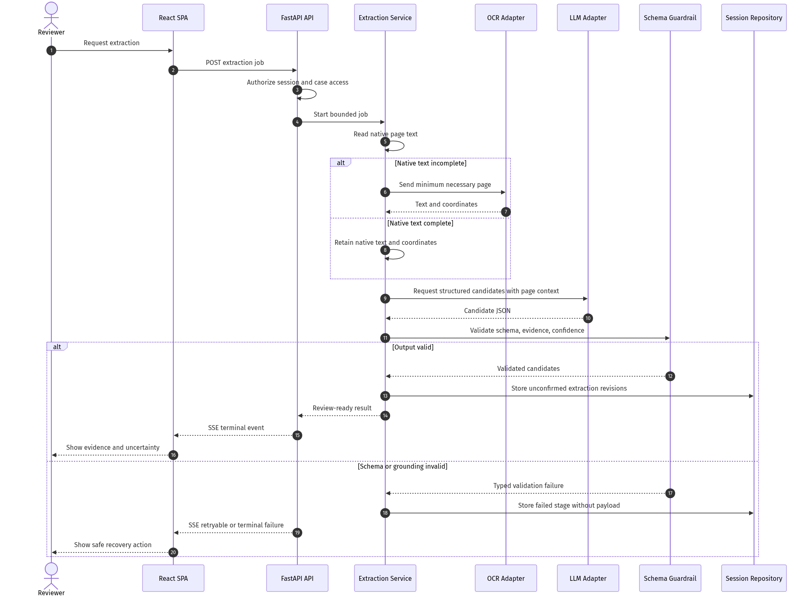

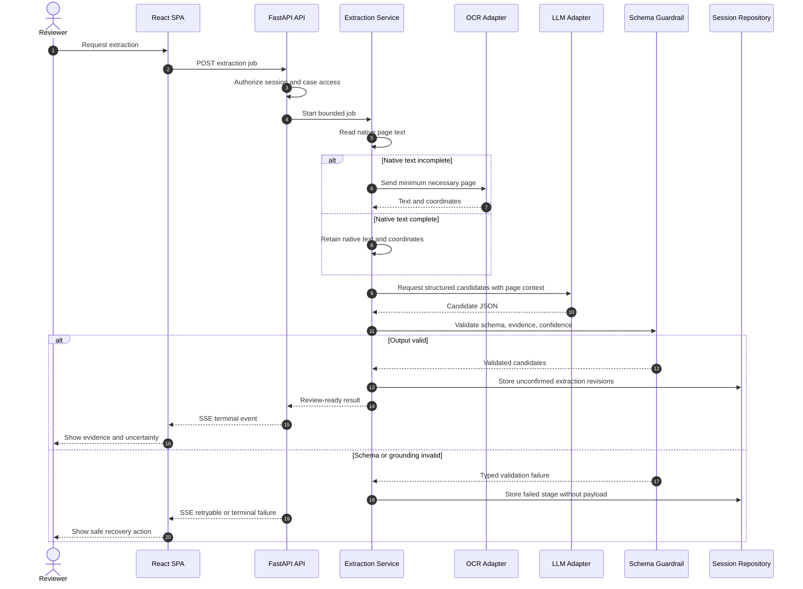
```mermaid
sequenceDiagram
  autonumber
  actor Reviewer
  participant UI as React SPA
  participant API as FastAPI API
  participant Extract as Extraction Service
  participant OCR as OCR Adapter
  participant LLM as LLM Adapter
  participant Guard as Schema Guardrail
  participant State as Session Repository

  Reviewer->>UI: Request extraction
  UI->>API: POST extraction job
  API->>API: Authorize session and case access
  API->>Extract: Start bounded job
  Extract->>Extract: Read native page text
  alt Native text incomplete
    Extract->>OCR: Send minimum necessary page
    OCR-->>Extract: Text and coordinates
  else Native text complete
    Extract->>Extract: Retain native text and coordinates
  end
  Extract->>LLM: Request structured candidates with page context
  LLM-->>Extract: Candidate JSON
  Extract->>Guard: Validate schema, evidence, confidence
  alt Output valid
    Guard-->>Extract: Validated candidates
    Extract->>State: Store unconfirmed extraction revisions
    Extract-->>API: Review-ready result
    API-->>UI: SSE terminal event
    UI-->>Reviewer: Show evidence and uncertainty
  else Schema or grounding invalid
    Guard-->>Extract: Typed validation failure
    Extract->>State: Store failed stage without payload
    API-->>UI: SSE retryable or terminal failure
    UI-->>Reviewer: Show safe recovery action
  end
```

#### AI Sequence Diagram — UC-005

**Source:** [UC-005 in spec.md](./spec.md#uc-005-sourceinput-generate-a-grounded-poc-draft)

<!-- RENDER type="mermaid" src="./uml-models/AI-002-uc-005-poc-generation.png" -->

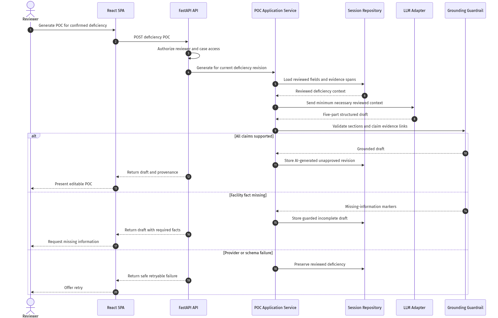

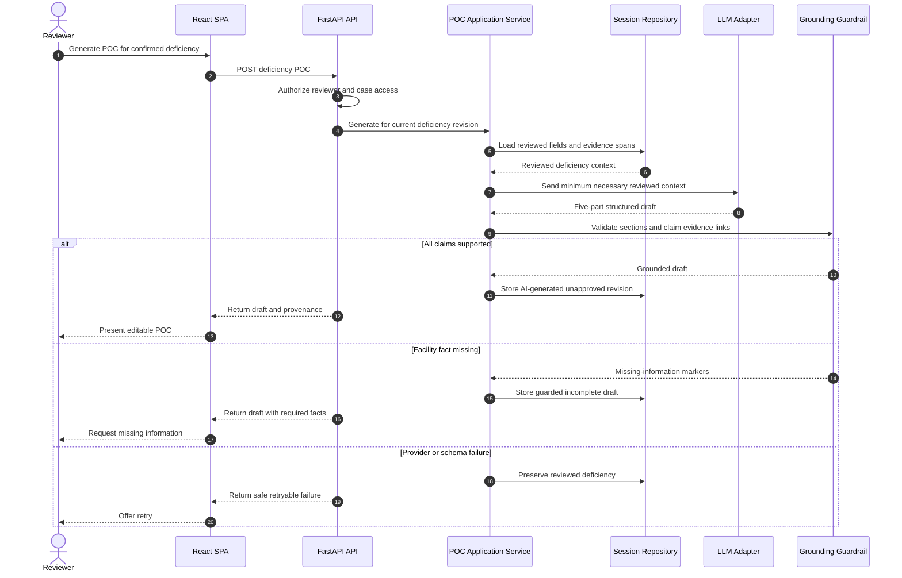
```mermaid
sequenceDiagram
  autonumber
  actor Reviewer
  participant UI as React SPA
  participant API as FastAPI API
  participant POC as POC Application Service
  participant State as Session Repository
  participant LLM as LLM Adapter
  participant Guard as Grounding Guardrail

  Reviewer->>UI: Generate POC for confirmed deficiency
  UI->>API: POST deficiency POC
  API->>API: Authorize reviewer and case access
  API->>POC: Generate for current deficiency revision
  POC->>State: Load reviewed fields and evidence spans
  State-->>POC: Reviewed deficiency context
  POC->>LLM: Send minimum necessary reviewed context
  LLM-->>POC: Five-part structured draft
  POC->>Guard: Validate sections and claim evidence links
  alt All claims supported
    Guard-->>POC: Grounded draft
    POC->>State: Store AI-generated unapproved revision
    API-->>UI: Return draft and provenance
    UI-->>Reviewer: Present editable POC
  else Facility fact missing
    Guard-->>POC: Missing-information markers
    POC->>State: Store guarded incomplete draft
    API-->>UI: Return draft with required facts
    UI-->>Reviewer: Request missing information
  else Provider or schema failure
    POC->>State: Preserve reviewed deficiency
    API-->>UI: Return safe retryable failure
    UI-->>Reviewer: Offer retry
  end
```

#### AI Sequence Diagram — UC-010

**Source:** [UC-010 in spec.md](./spec.md#uc-010-sourceinput-recover-from-a-processing-failure)

<!-- RENDER type="mermaid" src="./uml-models/AI-003-uc-010-recovery.png" -->

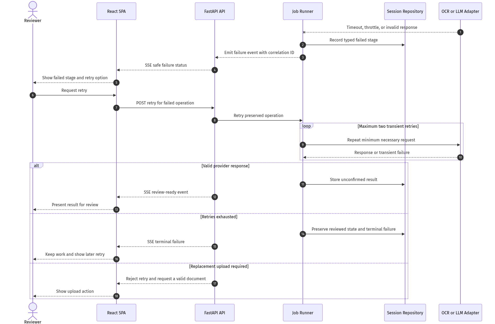

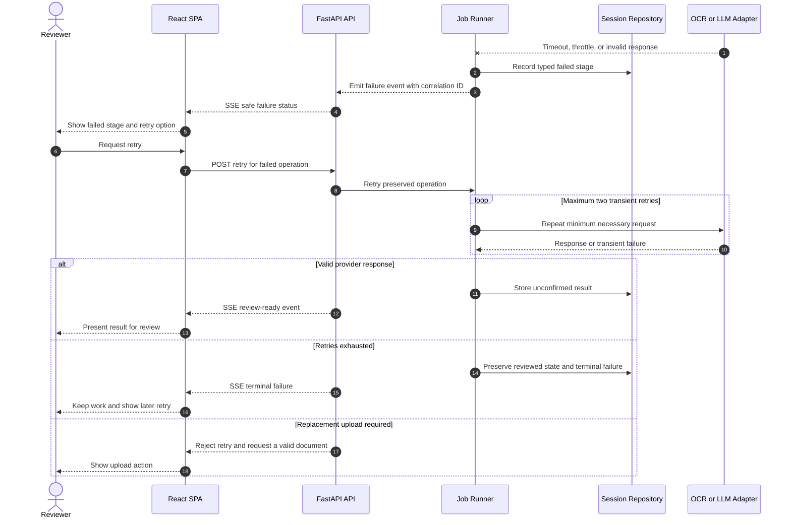
```mermaid
sequenceDiagram
  autonumber
  actor Reviewer
  participant UI as React SPA
  participant API as FastAPI API
  participant Job as Job Runner
  participant State as Session Repository
  participant Provider as OCR or LLM Adapter

  Provider--xJob: Timeout, throttle, or invalid response
  Job->>State: Record typed failed stage
  Job-->>API: Emit failure event with correlation ID
  API-->>UI: SSE safe failure status
  UI-->>Reviewer: Show failed stage and retry option
  Reviewer->>UI: Request retry
  UI->>API: POST retry for failed operation
  API->>Job: Retry preserved operation
  loop Maximum two transient retries
    Job->>Provider: Repeat minimum necessary request
    Provider-->>Job: Response or transient failure
  end
  alt Valid provider response
    Job->>State: Store unconfirmed result
    API-->>UI: SSE review-ready event
    UI-->>Reviewer: Present result for review
  else Retries exhausted
    Job->>State: Preserve reviewed state and terminal failure
    API-->>UI: SSE terminal failure
    UI-->>Reviewer: Keep work and show later retry
  else Replacement upload required
    API-->>UI: Reject retry and request a valid document
    UI-->>Reviewer: Show upload action
  end
```

---

## Use Case Sequence Diagrams

### UC-001: Upload and Validate a CMS-2567

**Source:** [UC-001 in spec.md](./spec.md#uc-001-sourceinput-upload-and-validate-a-cms-2567)

<!-- RENDER type="mermaid" src="./uml-models/SQ-001-upload-validate.png" -->

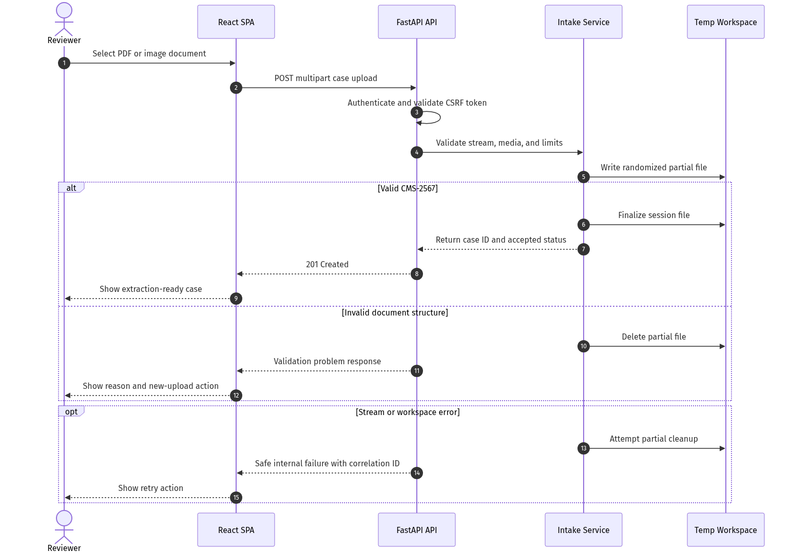

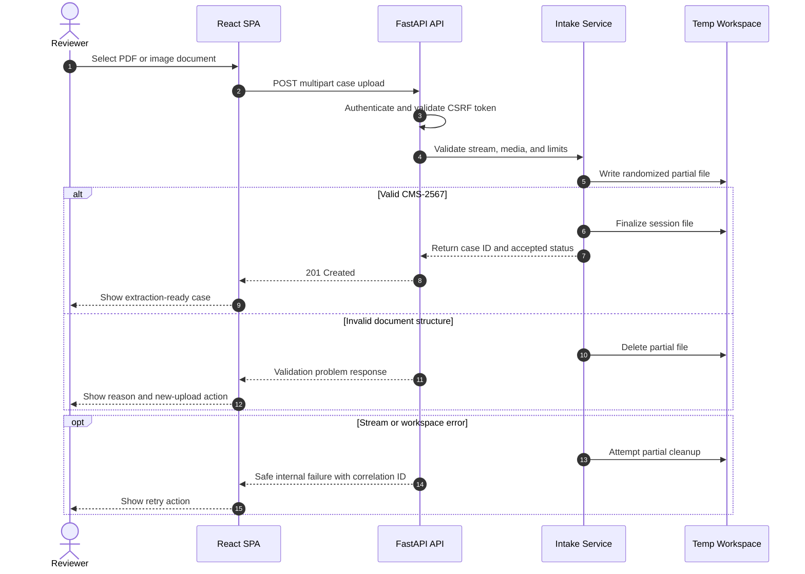
```mermaid
sequenceDiagram
  autonumber
  actor Reviewer
  participant UI as React SPA
  participant API as FastAPI API
  participant Intake as Intake Service
  participant Work as Temp Workspace

  Reviewer->>UI: Select PDF or image document
  UI->>API: POST multipart case upload
  API->>API: Authenticate and validate CSRF token
  API->>Intake: Validate stream, media, and limits
  Intake->>Work: Write randomized partial file
  alt Valid CMS-2567
    Intake->>Work: Finalize session file
    Intake-->>API: Return case ID and accepted status
    API-->>UI: 201 Created
    UI-->>Reviewer: Show extraction-ready case
  else Invalid document structure
    Intake->>Work: Delete partial file
    API-->>UI: Validation problem response
    UI-->>Reviewer: Show reason and new-upload action
  end
  opt Stream or workspace error
    Intake->>Work: Attempt partial cleanup
    API-->>UI: Safe internal failure with correlation ID
    UI-->>Reviewer: Show retry action
  end
```

---

### UC-002: Extract Provider and Deficiency Data

**Source:** [UC-002 in spec.md](./spec.md#uc-002-sourceinput-extract-provider-and-deficiency-data)

<!-- RENDER type="mermaid" src="./uml-models/SQ-002-extract-data.png" -->

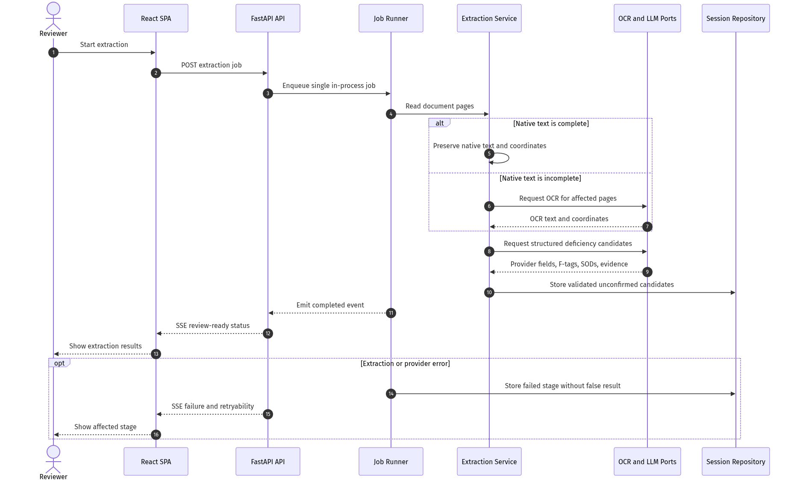

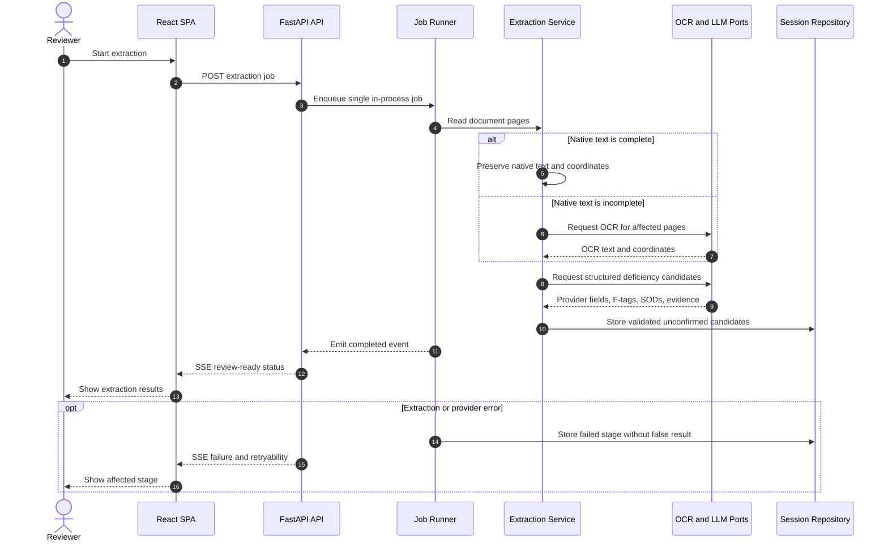
```mermaid
sequenceDiagram
  autonumber
  actor Reviewer
  participant UI as React SPA
  participant API as FastAPI API
  participant Job as Job Runner
  participant Extract as Extraction Service
  participant Provider as OCR and LLM Ports
  participant State as Session Repository

  Reviewer->>UI: Start extraction
  UI->>API: POST extraction job
  API->>Job: Enqueue single in-process job
  Job->>Extract: Read document pages
  alt Native text is complete
    Extract->>Extract: Preserve native text and coordinates
  else Native text is incomplete
    Extract->>Provider: Request OCR for affected pages
    Provider-->>Extract: OCR text and coordinates
  end
  Extract->>Provider: Request structured deficiency candidates
  Provider-->>Extract: Provider fields, F-tags, SODs, evidence
  Extract->>State: Store validated unconfirmed candidates
  Job-->>API: Emit completed event
  API-->>UI: SSE review-ready status
  UI-->>Reviewer: Show extraction results
  opt Extraction or provider error
    Job->>State: Store failed stage without false result
    API-->>UI: SSE failure and retryability
    UI-->>Reviewer: Show affected stage
  end
```

---

### UC-003: Resolve Uncertain Extraction

**Source:** [UC-003 in spec.md](./spec.md#uc-003-sourceinput-resolve-uncertain-extraction)

<!-- RENDER type="mermaid" src="./uml-models/SQ-003-resolve-uncertainty.png" -->

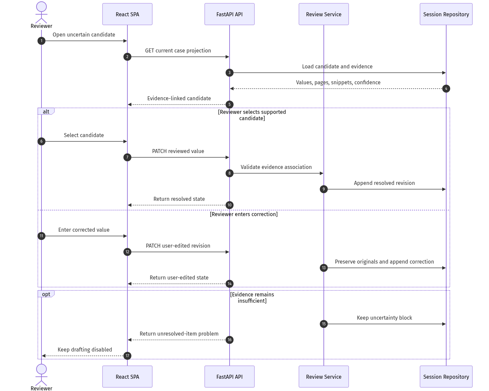

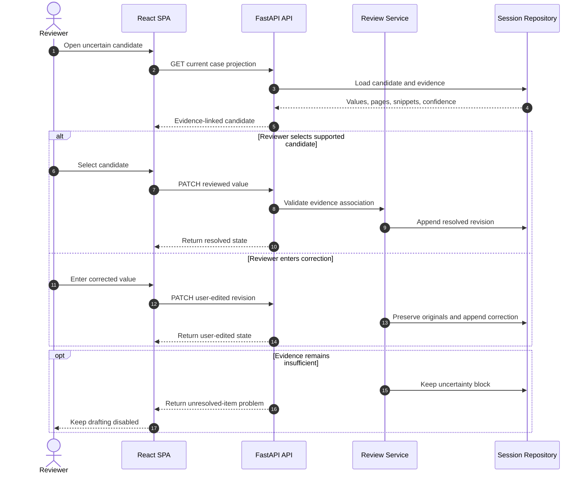
```mermaid
sequenceDiagram
  autonumber
  actor Reviewer
  participant UI as React SPA
  participant API as FastAPI API
  participant Review as Review Service
  participant State as Session Repository

  Reviewer->>UI: Open uncertain candidate
  UI->>API: GET current case projection
  API->>State: Load candidate and evidence
  State-->>API: Values, pages, snippets, confidence
  API-->>UI: Evidence-linked candidate
  alt Reviewer selects supported candidate
    Reviewer->>UI: Select candidate
    UI->>API: PATCH reviewed value
    API->>Review: Validate evidence association
    Review->>State: Append resolved revision
    API-->>UI: Return resolved state
  else Reviewer enters correction
    Reviewer->>UI: Enter corrected value
    UI->>API: PATCH user-edited revision
    Review->>State: Preserve originals and append correction
    API-->>UI: Return user-edited state
  end
  opt Evidence remains insufficient
    Review->>State: Keep uncertainty block
    API-->>UI: Return unresolved-item problem
    UI-->>Reviewer: Keep drafting disabled
  end
```

---

### UC-004: Correct and Confirm Extracted Data

**Source:** [UC-004 in spec.md](./spec.md#uc-004-sourceinput-correct-and-confirm-extracted-data)

<!-- RENDER type="mermaid" src="./uml-models/SQ-004-confirm-data.png" -->

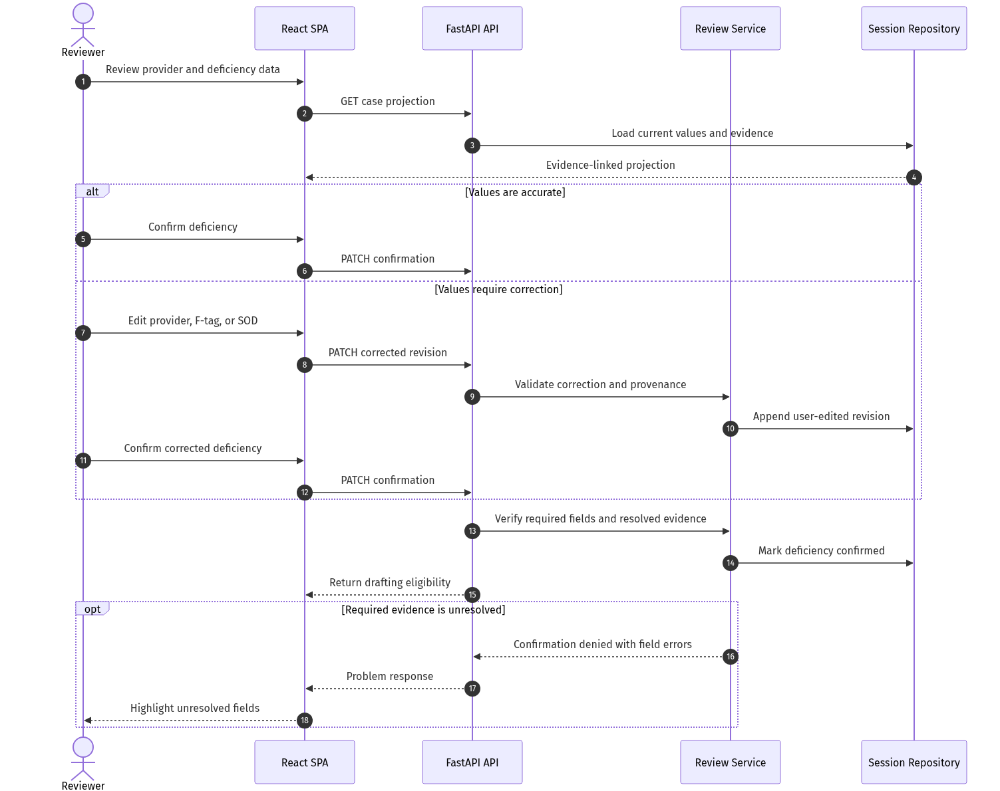

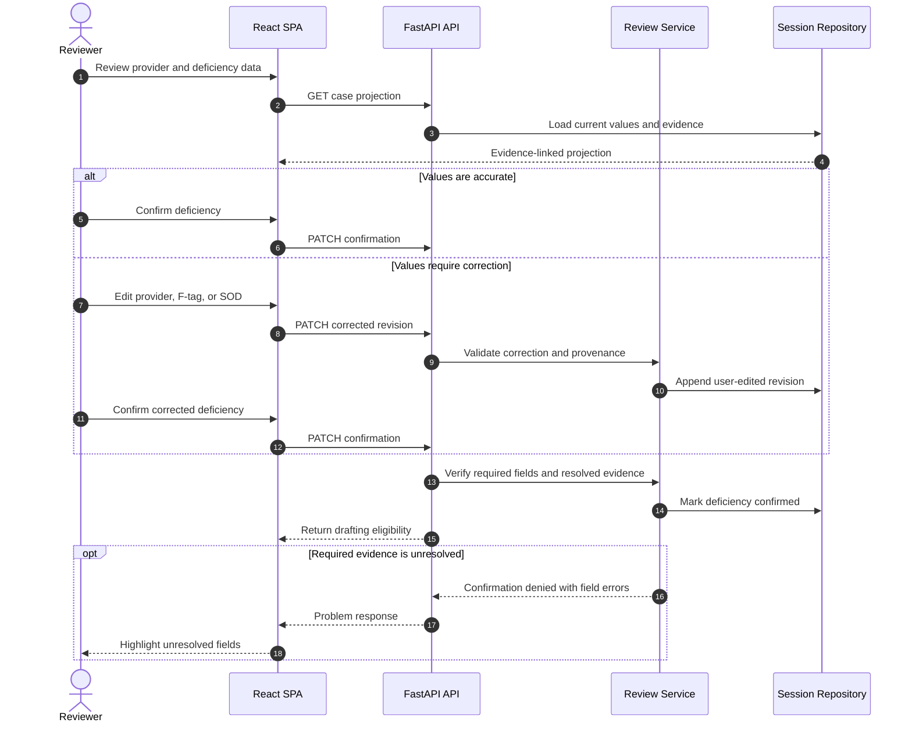
```mermaid
sequenceDiagram
  autonumber
  actor Reviewer
  participant UI as React SPA
  participant API as FastAPI API
  participant Review as Review Service
  participant State as Session Repository

  Reviewer->>UI: Review provider and deficiency data
  UI->>API: GET case projection
  API->>State: Load current values and evidence
  State-->>UI: Evidence-linked projection
  alt Values are accurate
    Reviewer->>UI: Confirm deficiency
    UI->>API: PATCH confirmation
  else Values require correction
    Reviewer->>UI: Edit provider, F-tag, or SOD
    UI->>API: PATCH corrected revision
    API->>Review: Validate correction and provenance
    Review->>State: Append user-edited revision
    Reviewer->>UI: Confirm corrected deficiency
    UI->>API: PATCH confirmation
  end
  API->>Review: Verify required fields and resolved evidence
  Review->>State: Mark deficiency confirmed
  API-->>UI: Return drafting eligibility
  opt Required evidence is unresolved
    Review-->>API: Confirmation denied with field errors
    API-->>UI: Problem response
    UI-->>Reviewer: Highlight unresolved fields
  end
```

---

### UC-005: Generate a Grounded POC Draft

**Source:** [UC-005 in spec.md](./spec.md#uc-005-sourceinput-generate-a-grounded-poc-draft)

<!-- RENDER type="mermaid" src="./uml-models/SQ-005-generate-poc.png" -->

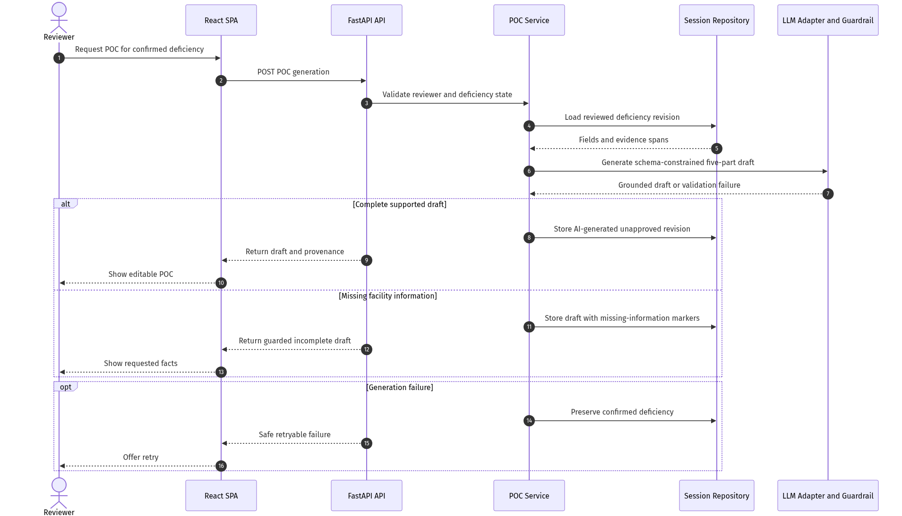

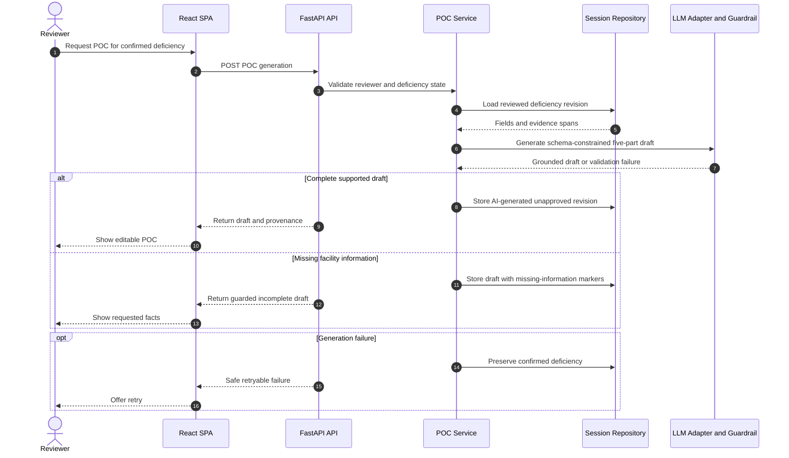
```mermaid
sequenceDiagram
  autonumber
  actor Reviewer
  participant UI as React SPA
  participant API as FastAPI API
  participant POC as POC Service
  participant State as Session Repository
  participant AI as LLM Adapter and Guardrail

  Reviewer->>UI: Request POC for confirmed deficiency
  UI->>API: POST POC generation
  API->>POC: Validate reviewer and deficiency state
  POC->>State: Load reviewed deficiency revision
  State-->>POC: Fields and evidence spans
  POC->>AI: Generate schema-constrained five-part draft
  AI-->>POC: Grounded draft or validation failure
  alt Complete supported draft
    POC->>State: Store AI-generated unapproved revision
    API-->>UI: Return draft and provenance
    UI-->>Reviewer: Show editable POC
  else Missing facility information
    POC->>State: Store draft with missing-information markers
    API-->>UI: Return guarded incomplete draft
    UI-->>Reviewer: Show requested facts
  end
  opt Generation failure
    POC->>State: Preserve confirmed deficiency
    API-->>UI: Safe retryable failure
    UI-->>Reviewer: Offer retry
  end
```

---

### UC-006: Edit a POC Draft

**Source:** [UC-006 in spec.md](./spec.md#uc-006-sourceinput-edit-a-poc-draft)

<!-- RENDER type="mermaid" src="./uml-models/SQ-006-edit-poc.png" -->

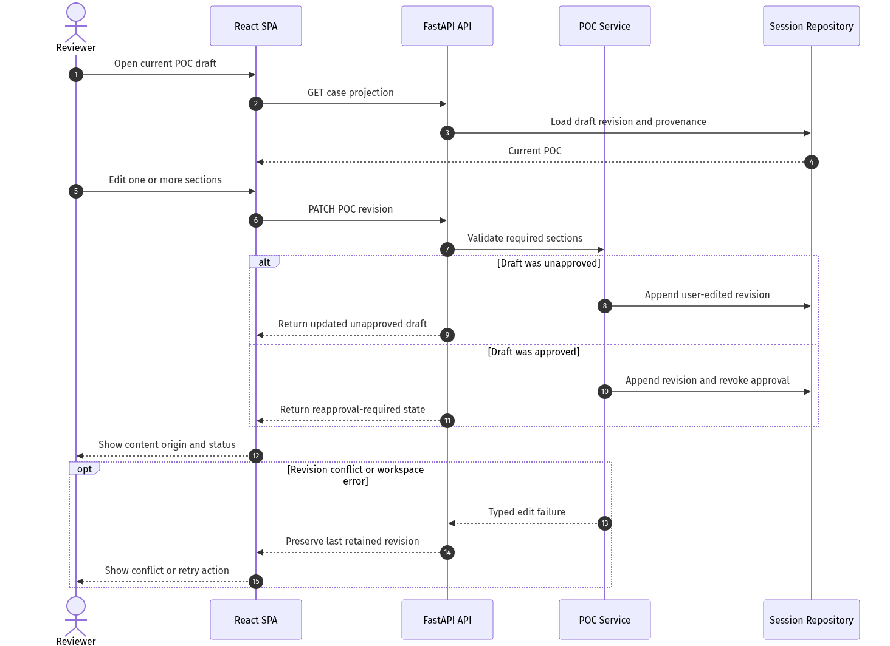

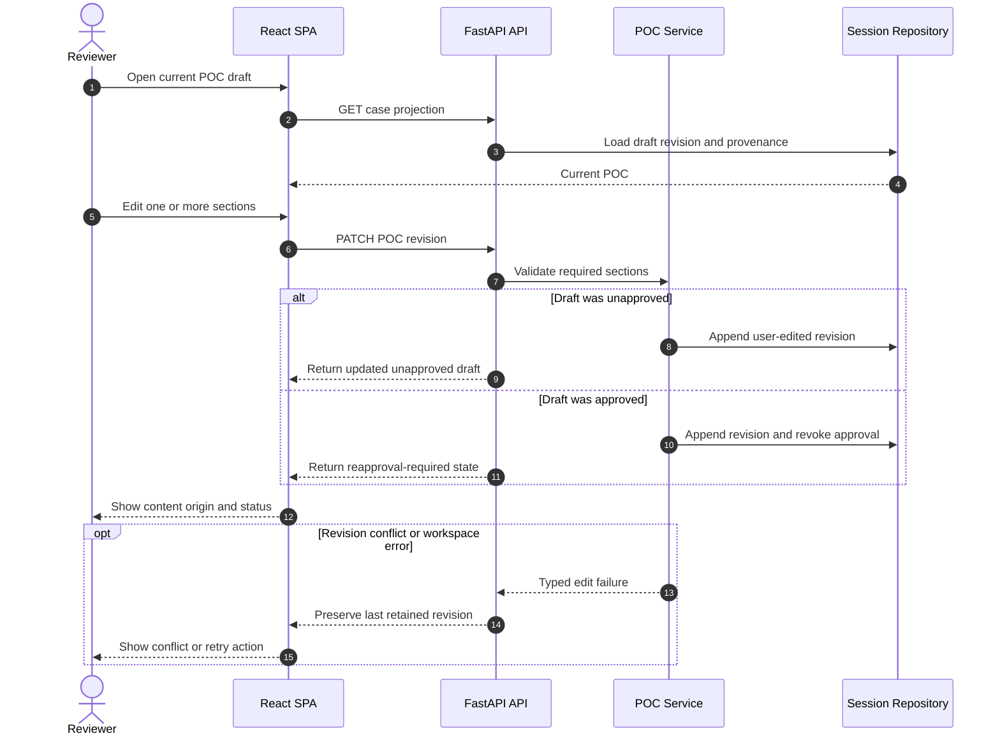
```mermaid
sequenceDiagram
  autonumber
  actor Reviewer
  participant UI as React SPA
  participant API as FastAPI API
  participant POC as POC Service
  participant State as Session Repository

  Reviewer->>UI: Open current POC draft
  UI->>API: GET case projection
  API->>State: Load draft revision and provenance
  State-->>UI: Current POC
  Reviewer->>UI: Edit one or more sections
  UI->>API: PATCH POC revision
  API->>POC: Validate required sections
  alt Draft was unapproved
    POC->>State: Append user-edited revision
    API-->>UI: Return updated unapproved draft
  else Draft was approved
    POC->>State: Append revision and revoke approval
    API-->>UI: Return reapproval-required state
  end
  UI-->>Reviewer: Show content origin and status
  opt Revision conflict or workspace error
    POC-->>API: Typed edit failure
    API-->>UI: Preserve last retained revision
    UI-->>Reviewer: Show conflict or retry action
  end
```

---

### UC-007: Approve a POC

**Source:** [UC-007 in spec.md](./spec.md#uc-007-sourceinput-approve-a-poc)

<!-- RENDER type="mermaid" src="./uml-models/SQ-007-approve-poc.png" -->

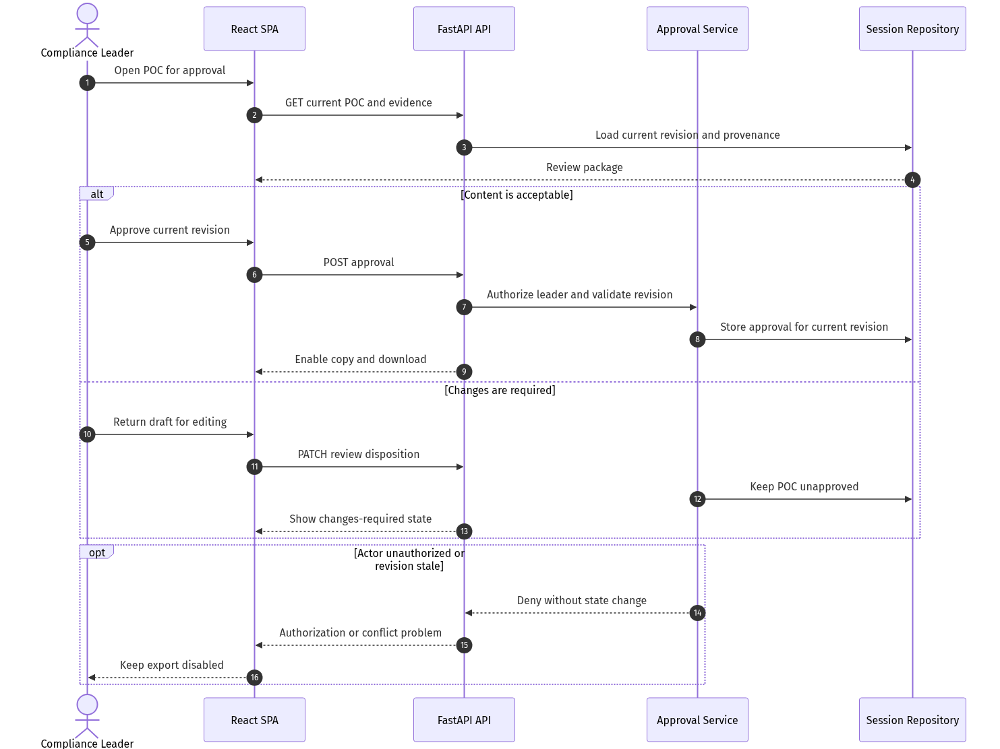

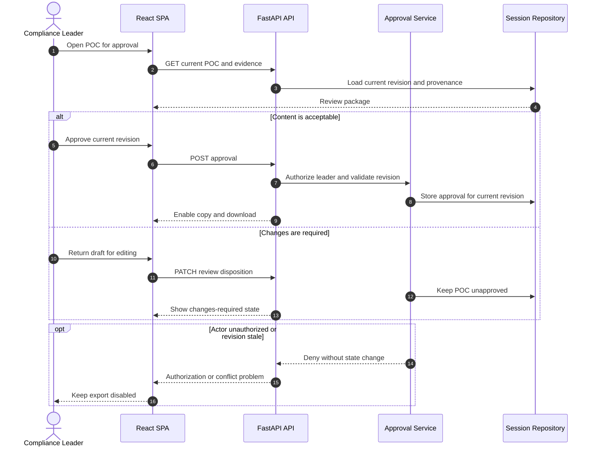
```mermaid
sequenceDiagram
  autonumber
  actor Leader as Compliance Leader
  participant UI as React SPA
  participant API as FastAPI API
  participant Approval as Approval Service
  participant State as Session Repository

  Leader->>UI: Open POC for approval
  UI->>API: GET current POC and evidence
  API->>State: Load current revision and provenance
  State-->>UI: Review package
  alt Content is acceptable
    Leader->>UI: Approve current revision
    UI->>API: POST approval
    API->>Approval: Authorize leader and validate revision
    Approval->>State: Store approval for current revision
    API-->>UI: Enable copy and download
  else Changes are required
    Leader->>UI: Return draft for editing
    UI->>API: PATCH review disposition
    Approval->>State: Keep POC unapproved
    API-->>UI: Show changes-required state
  end
  opt Actor unauthorized or revision stale
    Approval-->>API: Deny without state change
    API-->>UI: Authorization or conflict problem
    UI-->>Leader: Keep export disabled
  end
```

---

### UC-008: Copy or Download Approved Content

**Source:** [UC-008 in spec.md](./spec.md#uc-008-sourceinput-copy-or-download-approved-content)

<!-- RENDER type="mermaid" src="./uml-models/SQ-008-export-poc.png" -->

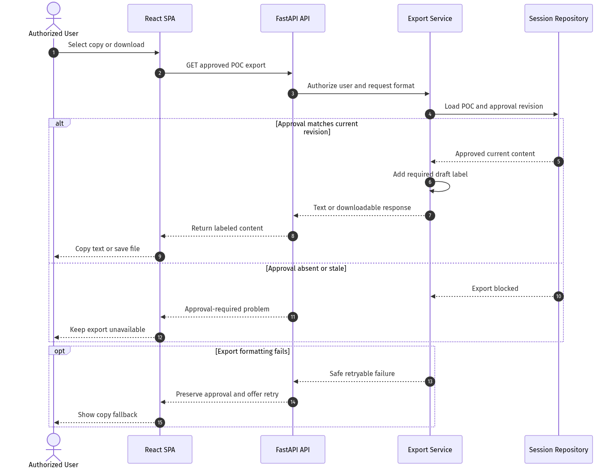

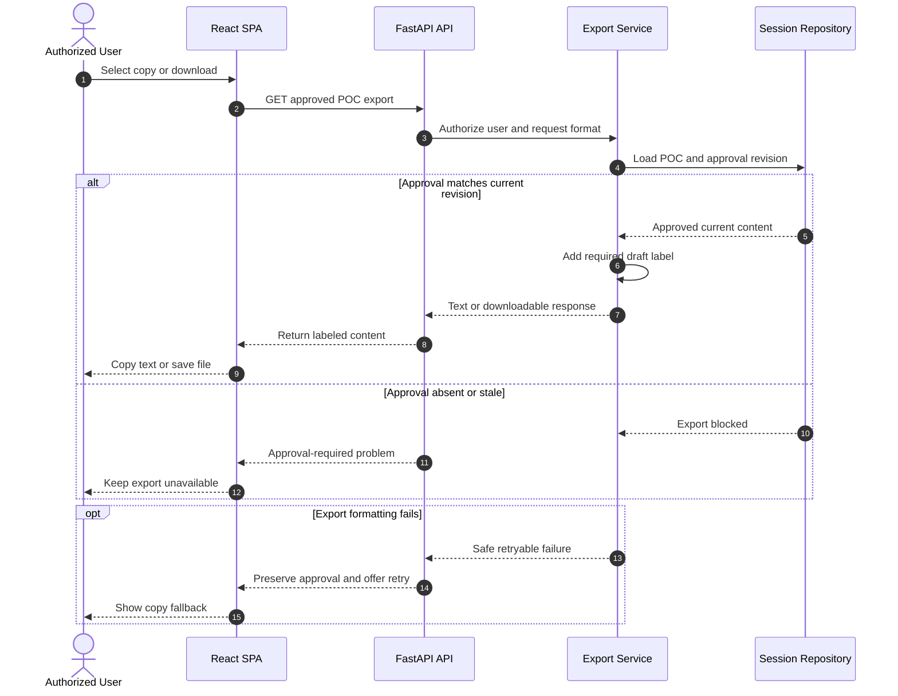
```mermaid
sequenceDiagram
  autonumber
  actor User as Authorized User
  participant UI as React SPA
  participant API as FastAPI API
  participant Export as Export Service
  participant State as Session Repository

  User->>UI: Select copy or download
  UI->>API: GET approved POC export
  API->>Export: Authorize user and request format
  Export->>State: Load POC and approval revision
  alt Approval matches current revision
    State-->>Export: Approved current content
    Export->>Export: Add required draft label
    Export-->>API: Text or downloadable response
    API-->>UI: Return labeled content
    UI-->>User: Copy text or save file
  else Approval absent or stale
    State-->>Export: Export blocked
    API-->>UI: Approval-required problem
    UI-->>User: Keep export unavailable
  end
  opt Export formatting fails
    Export-->>API: Safe retryable failure
    API-->>UI: Preserve approval and offer retry
    UI-->>User: Show copy fallback
  end
```

---

### UC-009: End a Transient Working Session

**Source:** [UC-009 in spec.md](./spec.md#uc-009-sourceinput-end-a-transient-working-session)

<!-- RENDER type="mermaid" src="./uml-models/SQ-009-end-session.png" -->

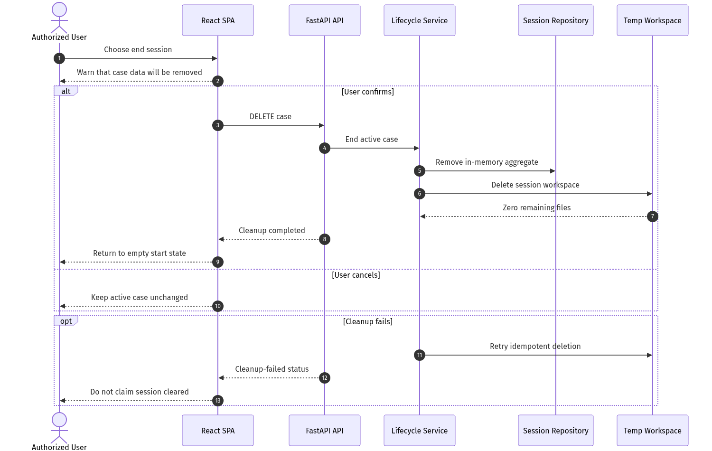

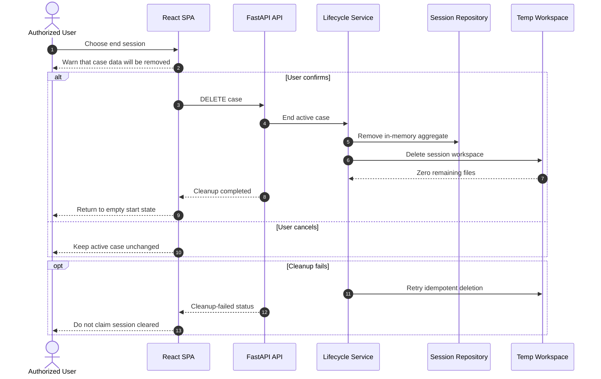
```mermaid
sequenceDiagram
  autonumber
  actor User as Authorized User
  participant UI as React SPA
  participant API as FastAPI API
  participant Life as Lifecycle Service
  participant State as Session Repository
  participant Work as Temp Workspace

  User->>UI: Choose end session
  UI-->>User: Warn that case data will be removed
  alt User confirms
    UI->>API: DELETE case
    API->>Life: End active case
    Life->>State: Remove in-memory aggregate
    Life->>Work: Delete session workspace
    Work-->>Life: Zero remaining files
    API-->>UI: Cleanup completed
    UI-->>User: Return to empty start state
  else User cancels
    UI-->>User: Keep active case unchanged
  end
  opt Cleanup fails
    Life->>Work: Retry idempotent deletion
    API-->>UI: Cleanup-failed status
    UI-->>User: Do not claim session cleared
  end
```

---

### UC-010: Recover from a Processing Failure

**Source:** [UC-010 in spec.md](./spec.md#uc-010-sourceinput-recover-from-a-processing-failure)

<!-- RENDER type="mermaid" src="./uml-models/SQ-010-recover-processing.png" -->

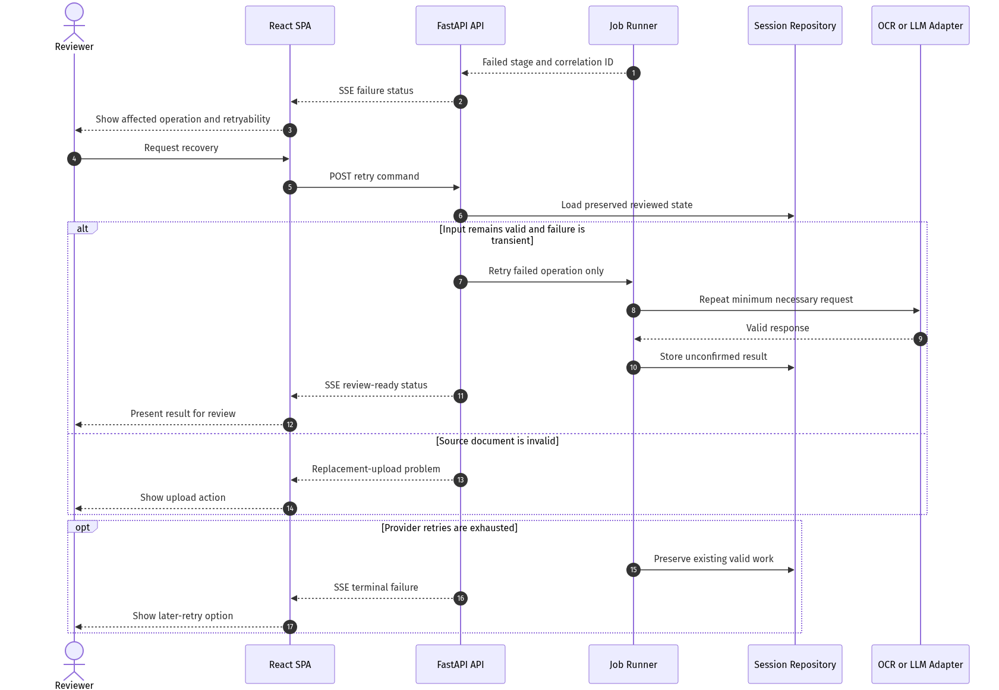

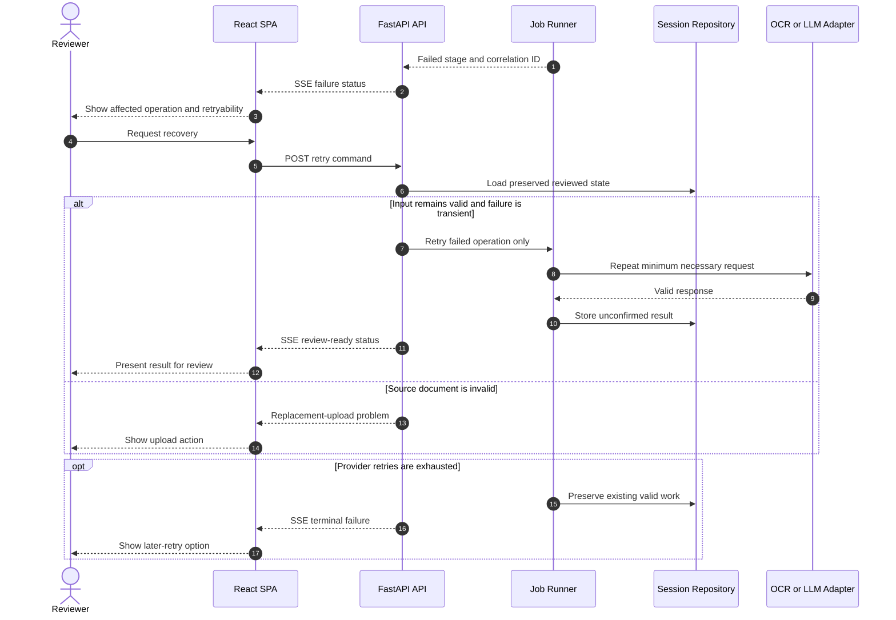
```mermaid
sequenceDiagram
  autonumber
  actor Reviewer
  participant UI as React SPA
  participant API as FastAPI API
  participant Job as Job Runner
  participant State as Session Repository
  participant Provider as OCR or LLM Adapter

  Job-->>API: Failed stage and correlation ID
  API-->>UI: SSE failure status
  UI-->>Reviewer: Show affected operation and retryability
  Reviewer->>UI: Request recovery
  UI->>API: POST retry command
  API->>State: Load preserved reviewed state
  alt Input remains valid and failure is transient
    API->>Job: Retry failed operation only
    Job->>Provider: Repeat minimum necessary request
    Provider-->>Job: Valid response
    Job->>State: Store unconfirmed result
    API-->>UI: SSE review-ready status
    UI-->>Reviewer: Present result for review
  else Source document is invalid
    API-->>UI: Replacement-upload problem
    UI-->>Reviewer: Show upload action
  end
  opt Provider retries are exhausted
    Job->>State: Preserve existing valid work
    API-->>UI: SSE terminal failure
    UI-->>Reviewer: Show later-retry option
  end
```
