# Requirements Specification

## Feature Goal

Build a localhost CMS Deficiency Action Planner that enables nursing-home
compliance staff to upload CMS-2567 documents, verify evidence-backed provider
and deficiency extraction, and prepare a separate structured Plan of Correction
for each reviewed deficiency. The end state replaces manual transcription and
ungrounded drafting with a traceable, uncertainty-aware workflow in which
authorized people retain responsibility for corrections, edits, and approval.

## Business Justification

- Reduce transcription errors and missed deficiencies during manual CMS-2567
  review while allowing compliance staff to verify every extracted value against
  its source.
- Reduce the effort and inconsistency involved in preparing separate correction
  plans without replacing professional compliance judgment.
- Give designated compliance leaders a controlled approval point before any
  generated content can be copied or downloaded for further use.
- Provide a focused localhost MVP that integrates document extraction, OCR, AI
  drafting, evidence review, and human approval without introducing persistent
  document management or CMS submission.

## Feature Scope

The MVP supports native-text, scanned, and mixed CMS-2567 PDFs and image-based
documents. A user can upload one survey document, review extracted provider and
deficiency data with page-level evidence, resolve uncertainty, generate and edit
one POC per confirmed deficiency, obtain authorized approval, and copy or
download the approved content as a labeled draft. Each POC uses a proposed
five-part structure covering affected residents, other residents at risk,
corrective measures, monitoring, and completion date; compliance reviewers must
validate this structure before it is finalized.

The MVP does not persist documents beyond the working session, submit or
communicate with CMS, make autonomous compliance decisions, approve POCs,
support multi-tenancy or enterprise authentication, provide advanced analytics,
or include cloud deployment and infrastructure automation.

### Success Criteria

- [ ] Provider name, F-tag, and complete SOD text achieve at least 95% field-level
  accuracy on an agreed representative evaluation set.
- [ ] Every deficiency in the evaluation set is detected or surfaced as an
  uncertain candidate requiring review.
- [ ] Reviewers can verify each extracted value, source page, supporting snippet,
  and uncertainty without manually searching the source document.
- [ ] Evaluated POC drafts contain no unsupported facility-specific factual
  claims and explicitly identify missing information.
- [ ] Every POC records human review and designated compliance-leader approval
  before copy or download.
- [ ] The localhost MVP is usable within the planned six-to-eight-week delivery
  window.

## Functional Requirements

### Document Intake

- FR-001: [DETERMINISTIC] [SOURCE:INPUT] (Must) The system MUST accept a
  supported CMS-2567 PDF or image-based document and start validation after the
  user submits it.
  Basis: The BRD explicitly requires upload and validation of CMS-2567 PDF and
  image-based documents.
  Traces to: UC-001.
- FR-002: [DETERMINISTIC] [SOURCE:INPUT] (Must) The system MUST reject an
  unreadable document or a document that cannot be validated as a CMS-2567,
  display the rejection reason, and allow another upload.
  Basis: The user confirmed rejection with a clear reason and retry for
  unreadable or invalid documents.
  Traces to: UC-001, UC-010.

### Extraction

- FR-003: [HYBRID] [SOURCE:INPUT] (Must) The system MUST extract available
  native document text and use OCR for pages whose native text is unavailable
  or incomplete.
  Basis: The BRD explicitly requires support for native, scanned, and mixed PDFs
  and OCR fallback.
  Traces to: UC-002, UC-010.
- FR-004: [HYBRID] [SOURCE:INPUT] (Must) The system MUST extract provider
  details and associate every extracted value with its source page, supporting
  snippet, and confidence indicator.
  Basis: The BRD requires provider extraction with page-level evidence and
  visible uncertainty.
  Traces to: UC-002, UC-004.
- FR-005: [HYBRID] [SOURCE:INPUT] (Must) The system MUST represent every
  detected F-tag and its complete Statement of Deficiency as a separate
  deficiency record with source evidence.
  Basis: The BRD requires detection of multiple deficiencies, F-tags, and
  complete SOD text.
  Traces to: UC-002, UC-004.
- FR-006: [HYBRID] [SOURCE:INPUT] (Must) The system MUST surface low-confidence
  or conflicting extraction candidates without selecting a final value and MUST
  require reviewer resolution before the affected deficiency can be confirmed.
  Basis: The BRD requires uncertain candidates, and the user confirmed mandatory
  reviewer resolution.
  Traces to: UC-002, UC-003.
- FR-007: [DETERMINISTIC] [SOURCE:INPUT] (Must) The system MUST identify the
  affected page or processing stage when extraction or OCR fails and MUST not
  present failed content as a confirmed result.
  Basis: Complete uncertainty review and accurate extraction require visible
  failure handling rather than silent omission.
  Traces to: UC-002, UC-010.

### Evidence Review

- FR-008: [DETERMINISTIC] [SOURCE:INPUT] (Must) The system MUST display each
  extracted provider field and deficiency beside its source page, supporting
  snippet, confidence, and uncertainty status.
  Basis: The BRD explicitly requires reviewers to verify each value without
  manually searching the document.
  Traces to: UC-003, UC-004.
- FR-009: [DETERMINISTIC] [SOURCE:INPUT] (Must) The system MUST allow a
  compliance reviewer to correct extracted values while preserving the original
  extracted value and evidence association.
  Basis: The BRD explicitly requires reviewer corrections while preserving
  original evidence.
  Traces to: UC-003, UC-004.
- FR-010: [DETERMINISTIC] [SOURCE:INPUT] (Must) The system MUST prevent POC
  generation for a deficiency until a compliance reviewer confirms or corrects
  its F-tag, complete SOD text, and supporting evidence.
  Basis: The user confirmed extraction review as a prerequisite to drafting.
  Traces to: UC-003, UC-004, UC-005.

### POC Drafting

- FR-011: [HYBRID] [SOURCE:INPUT] (Must) The system MUST generate a separate POC
  draft for each confirmed deficiency and MUST limit each draft to that
  deficiency's reviewed data.
  Basis: The BRD explicitly requires independent drafting for each reviewed
  deficiency.
  Traces to: UC-005.
- FR-012: [HYBRID] [SOURCE:INPUT] (Must) The system MUST organize each POC draft
  into affected residents, identification of others at risk, corrective
  measures, monitoring, and completion date.
  Basis: The user selected this proposed five-part structure, subject to
  compliance-reviewer validation before finalization.
  Traces to: UC-005, UC-006.
- FR-013: [HYBRID] [SOURCE:INPUT] (Must) The system MUST ground draft content in
  reviewed deficiency data, label any missing facility-specific information,
  and MUST NOT invent a value for missing information.
  Basis: The BRD requires grounded drafts with explicit missing facts and no
  unsupported facility-specific claims.
  Traces to: UC-005, UC-006.
- FR-014: [DETERMINISTIC] [SOURCE:INPUT] (Must) The system MUST retain the
  reviewed deficiency when POC generation fails, display the failure, and allow
  the reviewer to retry generation.
  Basis: The drafting workflow must recover without forcing repeated extraction
  review or presenting incomplete output as successful.
  Traces to: UC-005, UC-010.

### Content Provenance

- FR-015: [DETERMINISTIC] [SOURCE:INPUT] (Must) The system MUST visibly
  distinguish extracted content, AI-generated content, user-edited content, and
  approved content throughout review and drafting.
  Basis: The BRD explicitly requires differentiation of these content states.
  Traces to: UC-004, UC-005, UC-006, UC-007.

### Approval

- FR-016: [DETERMINISTIC] [SOURCE:INPUT] (Must) The system MUST allow compliance
  staff to review and edit POCs and MUST restrict approval to a designated
  compliance leader.
  Basis: The user confirmed separate reviewer/editor and approver
  responsibilities.
  Traces to: UC-006, UC-007.
- FR-017: [DETERMINISTIC] [SOURCE:INPUT] (Must) The system MUST prevent copy or
  download of a POC until a designated compliance leader approves it.
  Basis: The BRD requires authorized human approval before use or export.
  Traces to: UC-007, UC-008.
- FR-018: [DETERMINISTIC] [SOURCE:INPUT] (Must) The system MUST revoke a POC's
  approval when its content is edited and MUST require designated
  compliance-leader reapproval.
  Basis: The user confirmed that edits to approved content invalidate approval.
  Traces to: UC-006, UC-007, UC-008.

### Export

- FR-019: [DETERMINISTIC] [SOURCE:INPUT] (Must) The system MUST let a user copy
  or download approved POC content and MUST label the exported content as a
  draft for compliance handling and any submission outside the system.
  Basis: The BRD explicitly permits copy or download of approved, clearly
  labeled draft content and excludes CMS submission.
  Traces to: UC-008.

### Session Lifecycle

- FR-020: [DETERMINISTIC] [SOURCE:INPUT] (Must) The system MUST retain document,
  review, draft, and approval state only for the active working session and MUST
  remove that state when the user ends the session.
  Basis: The BRD limits the MVP to transient session state and excludes
  persistent document management.
  Traces to: UC-001, UC-009.

## Use Case Analysis

### Actors & System Boundary

- Compliance Reviewer: Primary actor who uploads survey documents, verifies and
  corrects extraction, generates POC drafts, and edits draft content.
- Compliance Leader: Secondary and business actor who performs authorized human
  approval and can copy or download approved drafts.
- External OCR Service: System actor that returns text for scanned or incomplete
  document pages under approved PHI-handling terms.
- External AI Service: System actor that extracts document concepts and creates
  grounded POC drafts under approved PHI-handling terms.
- CMS or State Survey Agency: External stakeholder that may receive a correction
  plan outside this system; the MVP neither submits content nor communicates with
  this actor.

The system boundary includes document intake, extraction, evidence review, POC
drafting, provenance display, approval, export, and transient session handling.
It excludes persistent storage, external submission, and autonomous compliance
decisions.

### System Context Diagram

<!-- RENDER type="plantuml" src="./uml-models/system-context.puml" -->

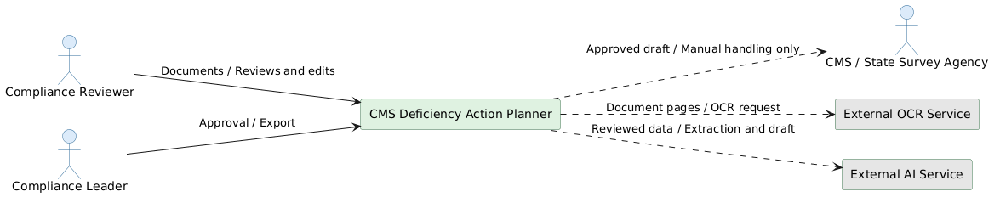

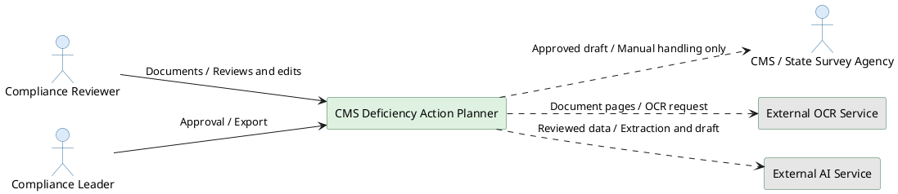

### Use Case Specifications

#### UC-006: [SOURCE:INPUT] Edit a POC Draft

- **Basis**: The BRD requires human editing, and the user confirmed that editing
  approved content revokes approval.
- **Actor(s)**: Compliance Reviewer
- **Parent Requirements**: FR-012, FR-013, FR-015, FR-016, FR-018
- **Goal**: Replace or supplement generated draft text with reviewer-authored
  content while preserving provenance.
- **Preconditions**: A POC draft exists for a confirmed deficiency.
- **Success Scenario**:
  1. The reviewer opens a POC draft.
  2. The reviewer edits one or more POC sections.
  3. The system labels changed content as user-edited.
  4. The system saves the updated draft in the active session.
  5. If the draft was approved, the system revokes approval and marks it as
     requiring reapproval.
- **Extensions/Alternatives**:
  - 2a. If the reviewer removes required section content, the system identifies
    the incomplete section before approval can occur.
  - 4a. If the edit cannot be retained, the system reports the failure and keeps
    the last successfully retained draft.
- **Postconditions**: The updated POC remains unapproved until a designated
  compliance leader approves its current content.

##### Use Case Diagram

<!-- RENDER type="plantuml" src="./uml-models/uc-edit-poc.puml" -->

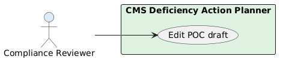

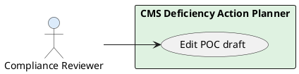

#### UC-007: [SOURCE:INPUT] Approve a POC

- **Basis**: The BRD requires authorized human approval, and the user assigned
  approval to designated compliance leaders.
- **Actor(s)**: Compliance Leader
- **Parent Requirements**: FR-015, FR-016, FR-017, FR-018
- **Goal**: Approve the current reviewed POC content for copy or download.
- **Preconditions**: A complete POC draft exists, and the actor is a designated
  compliance leader.
- **Success Scenario**:
  1. The compliance leader reviews the deficiency, evidence, content provenance,
     and all five POC sections.
  2. The compliance leader approves the current draft.
  3. The system records the approval state for the current content.
  4. The system enables copy and download actions.
- **Extensions/Alternatives**:
  - 2a. If the leader requests changes, the system leaves the POC unapproved and
    returns it for editing.
  - 2b. If the actor is not a designated compliance leader, the system refuses
    approval.
  - 4a. If content changes after approval, the system revokes approval and
    disables copy and download.
- **Postconditions**: The unchanged current POC is approved and exportable, or it
  remains unapproved with export disabled.

##### Use Case Diagram

<!-- RENDER type="plantuml" src="./uml-models/uc-approve-poc.puml" -->

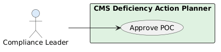

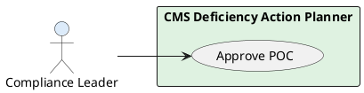

#### UC-008: [SOURCE:INPUT] Copy or Download Approved Content

- **Basis**: The BRD permits copy or download only for approved content and
  requires it to remain clearly labeled as a draft.
- **Actor(s)**: Compliance Reviewer, Compliance Leader
- **Parent Requirements**: FR-017, FR-018, FR-019
- **Goal**: Obtain approved POC content for controlled use outside the MVP.
- **Preconditions**: The POC's current content has designated
  compliance-leader approval.
- **Success Scenario**:
  1. The user selects copy or download.
  2. The system verifies that approval applies to the current content.
  3. The system produces the approved content with a clear draft label.
  4. The user receives the copied text or downloaded file for handling outside
     the system.
- **Extensions/Alternatives**:
  - 2a. If approval is absent or was revoked, the system blocks export and
    identifies that approval is required.
  - 3a. If download generation fails, the system reports the failure without
    changing approval and permits retry or copy.
- **Postconditions**: The user has a labeled copy of approved content; the system
  has not submitted or transmitted it to CMS or a survey agency.

##### Use Case Diagram

<!-- RENDER type="plantuml" src="./uml-models/uc-export-poc.puml" -->

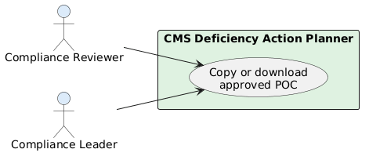

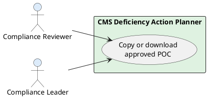

#### UC-009: [SOURCE:INPUT] End a Transient Working Session

- **Basis**: The BRD requires transient session state and excludes persistent
  document management.
- **Actor(s)**: Compliance Reviewer, Compliance Leader
- **Parent Requirements**: FR-020
- **Goal**: End work without retaining case content as a managed document record.
- **Preconditions**: An active session contains uploaded, extracted, reviewed, or
  drafted content.
- **Success Scenario**:
  1. The user chooses to end the working session.
  2. The system warns that active case content will not remain available.
  3. The user confirms session termination.
  4. The system removes the session's document and working state.
- **Extensions/Alternatives**:
  - 3a. If the user cancels, the system keeps the active session unchanged.
  - 4a. If state removal cannot be completed, the system reports the failure and
    does not claim that the session was cleared.
- **Postconditions**: The session content is removed, or the active session
  remains available with a visible failure state.

##### Use Case Diagram

<!-- RENDER type="plantuml" src="./uml-models/uc-end-session.puml" -->

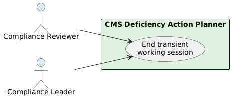

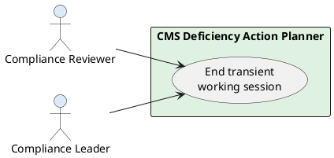

#### UC-010: [SOURCE:INPUT] Recover from a Processing Failure

- **Basis**: The BRD requires reliable extraction and review; visible retry
  behavior is necessary to prevent failed processing from appearing complete.
- **Actor(s)**: Compliance Reviewer, External OCR Service, External AI Service
- **Parent Requirements**: FR-002, FR-003, FR-007, FR-014
- **Goal**: Recover from document, OCR, extraction, or drafting failure without
  losing valid reviewed work.
- **Preconditions**: A processing operation has failed during an active session.
- **Success Scenario**:
  1. The system identifies the failed operation and affected document,
     deficiency, or page.
  2. The system preserves previously validated and reviewed session data.
  3. The reviewer corrects the input when necessary and requests a retry.
  4. The system retries only the failed operation.
  5. The system presents successful output for review without marking it
     confirmed automatically.
- **Extensions/Alternatives**:
  - 3a. If the source document is unreadable or invalid, the system requires a
    replacement upload instead of retrying extraction.
  - 4a. If an external service fails again, the system retains valid work,
    reports the repeated failure, and permits another retry.
- **Postconditions**: Processing resumes with preserved reviewed data, or the
  failure remains explicit without false completion.

##### Use Case Diagram

<!-- RENDER type="plantuml" src="./uml-models/uc-recover-processing.puml" -->

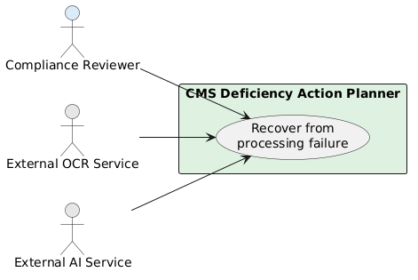

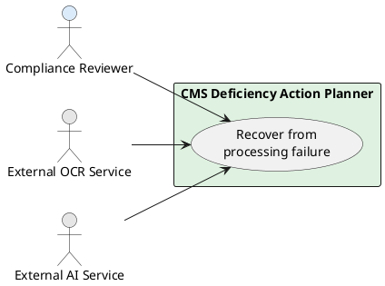

#### UC-001: [SOURCE:INPUT] Upload and Validate a CMS-2567

- **Basis**: The BRD requires document upload and validation; the user confirmed
  rejection and retry for unreadable or invalid documents.
- **Actor(s)**: Compliance Reviewer
- **Parent Requirements**: FR-001, FR-002, FR-020
- **Goal**: Start a transient case from a supported CMS-2567 document.
- **Preconditions**: The reviewer has begun a working session and has a survey
  document available.
- **Success Scenario**:
  1. The reviewer selects a PDF or image-based document.
  2. The system validates that the file is readable and consistent with a
     CMS-2567.
  3. The system accepts the document and starts extraction in the active session.
- **Extensions/Alternatives**:
  - 2a. If the document is unreadable, the system rejects it, explains the
    reason, and permits another upload.
  - 2b. If the document cannot be validated as a CMS-2567, the system rejects it
    without creating extraction results.
- **Postconditions**: A validated document is available for extraction, or the
  session remains ready for another upload with no false results created.

##### Use Case Diagram

<!-- RENDER type="plantuml" src="./uml-models/uc-upload-document.puml" -->

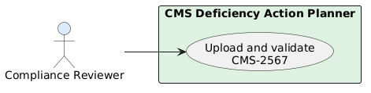

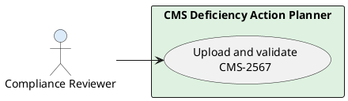

#### UC-002: [SOURCE:INPUT] Extract Provider and Deficiency Data

- **Basis**: The BRD requires provider, F-tag, and complete SOD extraction from
  native, scanned, and mixed documents.
- **Actor(s)**: Compliance Reviewer, External OCR Service, External AI Service
- **Parent Requirements**: FR-003, FR-004, FR-005, FR-006, FR-007
- **Goal**: Produce evidence-linked extraction results for every detected
  deficiency.
- **Preconditions**: The system has accepted a CMS-2567 document.
- **Success Scenario**:
  1. The system reads native text from each page where available.
  2. The system sends pages with missing or incomplete text to the OCR service.
  3. The system identifies provider details, F-tags, and complete SOD text.
  4. The system creates a separate record for each deficiency with page,
     snippet, confidence, and uncertainty information.
  5. The reviewer receives the extraction results for review.
- **Extensions/Alternatives**:
  - 2a. If OCR fails for a page, the system marks that page and processing stage
    as failed and does not confirm its content.
  - 3a. If candidates conflict or confidence is low, the system marks the values
    as uncertain for reviewer resolution.
- **Postconditions**: Extracted results and any failures or uncertain candidates
  are available in the active session.

##### Use Case Diagram

<!-- RENDER type="plantuml" src="./uml-models/uc-extract-deficiencies.puml" -->

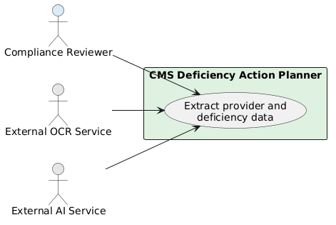

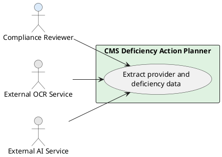

#### UC-003: [SOURCE:INPUT] Resolve Uncertain Extraction

- **Basis**: The BRD requires uncertainty review, and the user confirmed that
  unresolved candidates block confirmation and drafting.
- **Actor(s)**: Compliance Reviewer
- **Parent Requirements**: FR-006, FR-008, FR-009, FR-010
- **Goal**: Resolve every low-confidence or conflicting value using source
  evidence.
- **Preconditions**: Extraction has produced at least one uncertain candidate.
- **Success Scenario**:
  1. The system presents the uncertain value, alternatives, page, snippet, and
     confidence.
  2. The reviewer compares the candidates with the displayed source evidence.
  3. The reviewer selects a supported candidate or enters a correction.
  4. The system records the resolution while preserving the original candidates.
  5. The system removes the uncertainty block for that value.
- **Extensions/Alternatives**:
  - 3a. If the evidence is insufficient, the reviewer leaves the value unresolved
    and the system continues to block deficiency confirmation.
  - 3b. If a correction lacks supporting evidence, the system retains the
    correction as user-edited content without relabeling it as extracted content.
- **Postconditions**: The candidate is resolved with provenance, or it remains
  explicitly unresolved and blocked from drafting.

##### Use Case Diagram

<!-- RENDER type="plantuml" src="./uml-models/uc-resolve-uncertainty.puml" -->

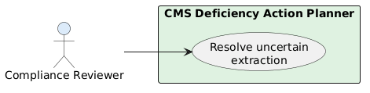

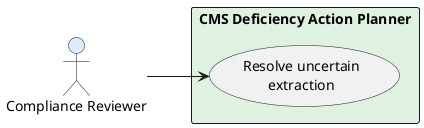

#### UC-004: [SOURCE:INPUT] Correct and Confirm Extracted Data

- **Basis**: The BRD requires editable extraction with original evidence
  preservation, and the user confirmed review before drafting.
- **Actor(s)**: Compliance Reviewer
- **Parent Requirements**: FR-004, FR-005, FR-008, FR-009, FR-010, FR-015
- **Goal**: Establish reviewed provider and deficiency data that can support POC
  drafting.
- **Preconditions**: Extraction results are available and all blocking uncertainty
  for the selected deficiency has been resolved.
- **Success Scenario**:
  1. The reviewer verifies provider fields against their displayed evidence.
  2. The reviewer verifies the selected F-tag, complete SOD, and supporting
     evidence.
  3. The reviewer corrects any inaccurate values.
  4. The system preserves original values and labels corrections as user-edited.
  5. The reviewer confirms the deficiency as ready for drafting.
- **Extensions/Alternatives**:
  - 2a. If the SOD is incomplete, the reviewer corrects it or returns the
    deficiency to unresolved status.
  - 5a. If any required evidence remains unresolved, the system refuses
    confirmation and identifies each unresolved item.
- **Postconditions**: The deficiency is confirmed and eligible for drafting, or
  remains blocked with visible unresolved items.

##### Use Case Diagram

<!-- RENDER type="plantuml" src="./uml-models/uc-confirm-extraction.puml" -->

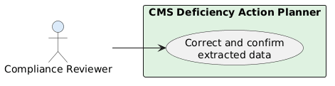

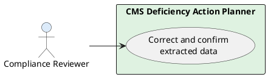

#### UC-005: [SOURCE:INPUT] Generate a Grounded POC Draft

- **Basis**: The BRD requires independent grounded drafts with missing facts
  identified, and the user confirmed the proposed five-part format.
- **Actor(s)**: Compliance Reviewer, External AI Service
- **Parent Requirements**: FR-010, FR-011, FR-012, FR-013, FR-014, FR-015
- **Goal**: Create an editable, evidence-grounded POC for one confirmed
  deficiency.
- **Preconditions**: The selected deficiency has confirmed F-tag, complete SOD,
  and supporting evidence.
- **Success Scenario**:
  1. The reviewer requests a draft for the selected deficiency.
  2. The system provides only that deficiency's reviewed data to the drafting
     service.
  3. The system receives draft content organized into the five proposed POC
     sections.
  4. The system checks that facility-specific claims are grounded in reviewed
     data and replaces missing facts with explicit information requests.
  5. The system labels the result as AI-generated and presents it for editing.
- **Extensions/Alternatives**:
  - 3a. If generation fails, the system preserves reviewed data, displays the
    failure, and permits retry.
  - 4a. If unsupported facility-specific content is detected, the system does
    not present that content as a completed factual claim.
- **Postconditions**: An unapproved POC draft is available for human editing, or
  the confirmed deficiency remains available for retry.

##### Use Case Diagram

<!-- RENDER type="plantuml" src="./uml-models/uc-generate-poc.puml" -->

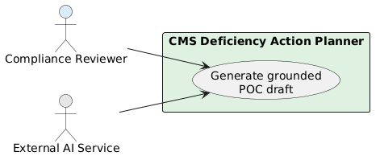

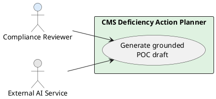

## Risks & Mitigations

- Extraction accuracy is evaluated on an unrepresentative sample: Define and
  approve a varied, legally usable ground-truth set before accepting the 95%
  target.
- A deficiency is missed or its SOD is incomplete: Surface uncertain candidates,
  retain page evidence, and require reviewer confirmation before drafting.
- AI-generated text includes unsupported facility facts: Limit generation to
  reviewed deficiency data, identify missing information explicitly, and require
  human editing and approval.
- The proposed five-part POC format does not meet reviewer or state-specific
  expectations: Validate it with practicing compliance reviewers and applicable
  legal or compliance owners before finalizing the format.
- External OCR or AI processing creates privacy or contractual exposure: Use
  only services approved for the intended PHI handling, with suitable BAAs,
  retention terms, and organizational risk review.
- Users mistake an approved draft for a CMS submission: Label exported content as
  a draft and keep CMS or survey-agency communication outside the system.
- Users treat every deficiency as requiring the same regulatory response:
  Preserve human review because 42 CFR 488.402(d) requires correction plans for
  covered deficiencies but identifies an exception for certain isolated
  minimal-harm deficiencies.
- Session termination causes unintended loss of work: Warn before clearing the
  transient session and allow cancellation.

## Constraints & Assumptions

- The product is a localhost MVP deliverable targeted for completion within six
  to eight weeks.
- Uploaded documents, extraction results, edits, drafts, and approvals exist
  only in transient session state; database-backed document management is out of
  scope.
- The product does not submit, transmit, or communicate correction plans to CMS
  or a state survey agency and does not determine whether a facility is exempt
  from a correction-plan obligation.
- Human compliance judgment remains authoritative. AI output is a draft and
  cannot approve itself or cause an autonomous corrective action.
- Compliance staff can review and edit; only a designated compliance leader can
  approve. The mechanism used to establish those roles is assumed to be supplied
  by the localhost operating context because enterprise authentication and SSO
  are out of scope.
- External OCR and AI services can be used only after the privacy/security owner
  approves PHI handling, HIPAA-compatible contractual terms, retention behavior,
  and risk controls.
- The five-part POC structure is the proposed MVP format and remains subject to
  validation with practicing nursing-home compliance reviewers.
- State-specific requirements beyond federal CMS expectations remain unresolved
  and require compliance or legal review before production use.
- English-only processing is assumed until the product owner confirms supported
  languages.
- Upload file-size and page-count limits remain to be set by the product owner
  and engineering lead using representative survey documents.
- The representative extraction test set, ground-truth labels, and scoring rules
  must be agreed before the 95% field-level accuracy criterion can be accepted.
- Access to legally usable CMS-2567 samples with varied native, scanned, and mixed
  content is assumed for validation.
