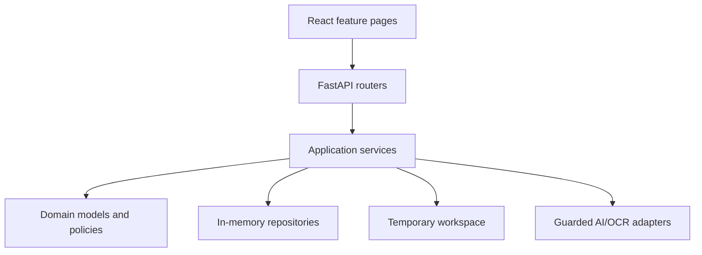

# CMS Deficiency Action Planner Technical Specifications

## System Summary

The system is a local-first CMS-2567 processing application composed of a
FastAPI backend and a React single-page frontend. It owns a transient workflow
from document intake through evidence review, POC generation, approval, and
plain-text export.

| Property | Specification |
|---|---|
| Backend | Python 3.14, FastAPI, Pydantic, PyMuPDF |
| Frontend | React 19, TypeScript 7, Vite 8 |
| Unit/integration tests | pytest and Vitest |
| Browser tests | Playwright with Chromium |
| Persistence | In-memory repositories and temporary filesystem uploads |
| Primary document | CMS-2567 PDF, maximum 50 MB and 200 pages |
| Local API | `http://127.0.0.1:8000` |
| Local frontend | `http://127.0.0.1:5173` |

## Architecture

The backend follows domain/application/adapter boundaries:

- `backend/src/domain`: session case aggregate and cross-cutting domain state.
- `backend/src/cms_planner/domain`: CMS deficiency, POC, approval, review, and
  extraction value objects.
- `backend/src/application` and `backend/src/cms_planner/application`:
  orchestration services and ports.
- `backend/src/adapters`: filesystem, in-memory repository, and provider adapters.
- `backend/src/cms_planner/api`: HTTP routing and response contracts.
- `backend/src/cms_planner/modules`: extraction, approval, and export modules.

The frontend is feature-oriented:

- `frontend/src/app`: session state and page selection.
- `frontend/src/features/document-intake`: upload and extraction progress.
- `frontend/src/features/extraction-review`: provider metadata, deficiencies,
  evidence, point hierarchy, and confirmation.
- `frontend/src/features/poc-authoring`: five-part POC editing and revisions.
- `frontend/src/features/approval-export`: review, approval, copy, and download.
- `frontend/src/shared`: API clients, models, session actions, and shared UI.



## Runtime Composition

`backend/src/api/main.py` exports the application created by
`backend/src/cms_planner/app.py`.

The default composition creates:

- `InMemoryCaseRepository` for active case state.
- `InMemoryPocRepository` for confirmed deficiencies and POC drafts.
- `TemporaryWorkspace` under `%TEMP%/cms-planner-workspaces` by default.
- `ExtractionJobRunner` for extraction progress events.
- A fail-closed OCR adapter unless an approved OCR provider is composed.
- An OpenAI-compatible POC provider when valid provider settings are available;
  otherwise POC generation reports provider unavailability.

Application shutdown executes cleanup for retained sessions and temporary files.

## Frontend State Model

The frontend uses `SessionContext` rather than a routing dependency. Page state is
one of:

- `intake`
- `processing`
- `extraction-review`
- `poc-authoring`
- `approval-export`

The local session identifier is `local-session`. The active case ID is retained
in browser `sessionStorage` under `cms-planner-active-case`. Server state remains
authoritative and is not persisted in the browser.

## Intake Contract

- Endpoint: `POST /api/v1/cases`
- Content type: multipart upload.
- Session identity: `X-Session-ID` request header.
- Maximum upload size: 50 MB.
- Maximum document length: 200 pages.
- Only one active upload/case is accepted per session.
- Unsupported, unreadable, or non-CMS documents return typed problem responses.
- Uploads are streamed in 64 KiB chunks to randomized temporary paths.

## Extraction Pipeline

### Page Reading

PyMuPDF reads native PDF text. Empty or non-substantive pages can be classified
for OCR. Text normalization removes encoding artifacts and normalizes line breaks
without changing retained page identity.

### Coordinate-Aware CMS Reading

CMS detection is document-scoped. For recognized CMS documents:

- Page 1 contributes a full-width header region for layout and provider metadata.
- Every page contributes only the left SOD body region.
- The right-side facility POC column is excluded from deficiency extraction.
- Repeated continuation-page headers and footer/disclosure bands are excluded.
- Non-CMS documents retain whole-page native text for intake classification.

The body region currently uses page-relative proportions: approximately the left
48 percent of page width between 20 and 82 percent of page height.

### CMS Layout Recognition

Recognition accepts:

- `FORM CMS-2567` with common spacing and dash variations; or
- The statement title and tag-column marker plus either the contiguous provider
  identification marker or the official CMS agency marker.

An unrecognized layout stops deficiency boundary creation.

### Provider Metadata

Provider metadata is extracted deterministically from standard CMS header labels:

- Provider/supplier name.
- Provider, supplier, or CLIA identification number.

Inline and following-line values are supported. Both values become evidence-linked
review fields and are displayed separately from deficiency records.

### Deficiency Boundaries

Tags use one alphabetic prefix and three or four digits and normalize to one
letter plus four digits. Supported forms include `F0686`, `F 686`, `F-0686`,
`F.686`, lowercase OCR output, and common Unicode dash substitutions.

Boundary processing:

- Retains zero tags with arbitrary prefixes, such as `E0000` and `K0000`.
- Separates prefetched Emergency Preparedness and Life Safety zero tags.
- Assigns prefetched `NFPA` headings to the following nonzero tag.
- Merges continuation pages and repeated normalized tags.
- Ignores repeated footer tags without discarding legitimate adjacent zero tags.
- Preserves ordered source-page evidence.
- Keeps Initial Comments separate from the following deficiency narrative.

### SOD and POC Point Processing

The complete extracted SOD remains authoritative. AI output cannot replace or
truncate it. Preprocessing recognizes hierarchical point markers such as `1.`,
`A.`, `i.`, and `a.`. The AI provider supplies POC text for each original point;
responses are mapped back by position while original labels and finding text are
preserved.

## Review and Confirmation

Review fields contain:

- Stable field and deficiency identities.
- Extracted candidates and immutable revisions.
- Origin (`Extracted`, `AI-generated`, `User-edited`, or `Approved`).
- Confidence, uncertainty, and page evidence.
- Current and confirmed revision identity.

Confirmation is deficiency-scoped. Provider metadata has no deficiency ID and is
not included in deficiency confirmation. A stale revision or unresolved required
field blocks confirmation.

## POC Model

Each POC revision contains five required values:

1. Affected residents.
2. Others at risk.
3. Corrective measures.
4. Monitoring.
5. Completion date.

Revisions are append-only. Section origin records whether content is AI-generated
or user-edited. Missing required information is represented explicitly rather
than fabricated.

## Approval and Export

Only the `compliance_leader` role can approve a POC. Approval binds to the current
revision ID. Editing approved content invalidates export authorization and moves
the case to reapproval-required state.

Export authorization checks:

- A current POC revision exists.
- The current revision is approved.
- Approval references the current revision rather than a stale revision.

Copy and download return `text/plain; charset=utf-8`. Export content includes the
mandatory draft-status label followed by the five approved POC values as plain
paragraphs in canonical order. Section headings are not included. Download uses
the filename `approved-poc-draft.txt`.

## API Surface

| Method and path | Purpose |
|---|---|
| `POST /api/v1/cases` | Upload and validate a CMS-2567 document. |
| `POST /api/v1/cases/{case_id}/extraction-jobs` | Start asynchronous extraction. |
| `GET /api/v1/jobs/{job_id}/events` | Stream extraction progress with SSE. |
| `GET /sessions/{session_id}/review` | Return provider and deficiency review fields. |
| `PATCH /sessions/{session_id}/deficiencies/{deficiency_id}/confirmation` | Confirm a reviewed deficiency revision. |
| `POST /deficiencies/{deficiency_id}/poc` | Generate a POC draft. |
| `GET /deficiencies/{deficiency_id}/poc` | Load the current POC draft. |
| `PATCH /deficiencies/{deficiency_id}/poc` | Append a POC edit revision. |
| `POST /api/v1/cases/{case_id}/approval` | Approve the current POC revision. |
| `POST /api/v1/cases/{case_id}/approval/request-changes` | Return an approved/reviewed revision for changes. |
| `GET /api/v1/cases/{case_id}/export?format=copy` | Return approved copy content. |
| `GET /api/v1/cases/{case_id}/export?format=download` | Return approved downloadable content. |
| `DELETE /api/v1/cases/{case_id}` | End a case and clean up transient state. |
| `GET /api/v1/session/status` | Query active local session status. |

FastAPI's generated OpenAPI document is the authoritative transport schema.

## Security and Privacy Controls

- Provider endpoints must use HTTPS.
- Provider credentials use secret types and are not returned through APIs.
- Provider use fails closed unless BAA, retention, training-use, and risk
  approvals are all present.
- Outbound payloads use application-owned schemas and minimum necessary content.
- Session IDs are required for case-scoped operations.
- Correlation IDs are propagated without logging document content.
- Upload paths are randomized and confined to the temporary workspace.
- Case state and document content are not durably persisted.
- Approval and export are server-authorized; frontend state cannot enable export.
- Export is local only and remains visibly labeled as a draft.

This application does not replace organizational access control, audit retention,
deployment hardening, or compliance review required for production use.

## Failure and Recovery Behavior

- Extraction jobs emit ordered progress and terminal events.
- OCR/provider failures are represented as typed, content-safe outcomes.
- Provider calls use bounded timeouts and retries where configured.
- Stale edits and approvals fail without replacing current state.
- Failed export formatting preserves approval state and allows retry/copy.
- End-session and shutdown cleanup remove temporary case artifacts.

## Testing Strategy

Backend tests are organized into:

- `tests/unit`: domain policies, services, extraction rules, and adapters.
- `tests/contract`: provider and schema boundaries.
- `tests/integration`: API, cleanup, extraction, approval, and recovery flows.
- `tests/architecture`: dependency and no-durable-storage constraints.

Frontend tests include component behavior with Vitest/Testing Library and browser
flows with Playwright.

```powershell
Set-Location backend
python -m pytest

Set-Location ..\frontend
npm test
npm run typecheck
npm run build
npm run test:e2e
```

## Known Constraints

- State is lost on backend restart.
- The default app composition has no durable database.
- One active case is supported per session.
- The primary supported document family is CMS-2567.
- Coordinate extraction assumes the standard CMS two-column form structure.
- Scanned pages require a configured and approved OCR provider.
- AI-assisted generation requires a compatible HTTPS chat-completions endpoint.
- The frontend uses a fixed local session identifier and is intended for local or
  controlled deployment unless authentication is extended.